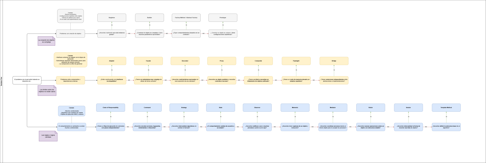

# Patrones de diseño

## ¿Qué son?

Los patrones de diseño son soluciones probadas y reutilizables a problemas recurrentes dentro dentro del diseño del software. Estos **NO** son un código listo para copiar y pegar, sino que más bien, son soluciones a un alto nivel, una especie de plantilla conceptual que permiten tener un código más mantenible, escalable y fácil de entender.

Según [Refactorin Guru](https://refactoring.guru/design-patterns) los patrones de diseño son un conjunto de herramientas que nos preparan para resolver problemas recurrentes y nos dan un lenguaje común para comunicarnos dentro del equipo de manera efectiva.

Uno de los primeros libros en tratar el tema fue **Design Patterns Elements of Reusable Object-Oriented Software** creado por **GoF** donde se dan a conocer 23 patrones que resuelven 23 problemas comunes.

## ¿Para qué se usan los patrones de diseño?

Los patrones de diseño nos permite escribir código utilizando las mejores prácticas para que este sea *estructurado*, *administrable* y *escalable* [ver más...](https://www.geeksforgeeks.org/system-design/software-design-patterns).

## Clasificación de los patrones de diseño

Los patrones de arquitectura son los más universales, son soluciones a alto nivel aplicadas en cualquier lenguaje de programación que permita la orientación a objetos. Adicionalmente, estos patrones son categorizados según su intención y proposito en los siguientes grupos: *Patrones Creacionales*, *Patrones Estructurales*, *Patrones de Comportamiento*

- **Patrones Creacionales**: Estos patrones proveen mecanismos para la creacion de objetos de manera eficiente, desacoplando la creación de objetos de nuestro código. [ver más...](creationals/README.creationals.md)

- **Patrones Estructurales**: Estos patrones nos enseñan como organizar y componer clases u objetos para formar sistemas complejos de manera sencilla. [ver más...](structurals/README.structurals.md)

- **Patrones de Comportamiento**: Estos patrones se encargan de cómo se comunican, interactuan y se dividen responsabilidades los objetos. [ver más...](behaviour/README.behaviour.md)

## Árbol de desiciones para elegir el patrón de diseño adecuado

Aprender los conceptos de cada patrón de diseño es importante, pero también lo es saber cuándo y cómo aplicarlos. Para esto, se puede usar un árbol de decisiones que nos guíe a través de una serie de preguntas para identificar el patrón de diseño más adecuado para nuestro problema específico. [Para profundizar más sobre este tema, puedes visitar este recurso](https://medium.com/womenintechnology/stop-memorizing-design-patterns-use-this-decision-tree-instead-e84f22fca9fa)

