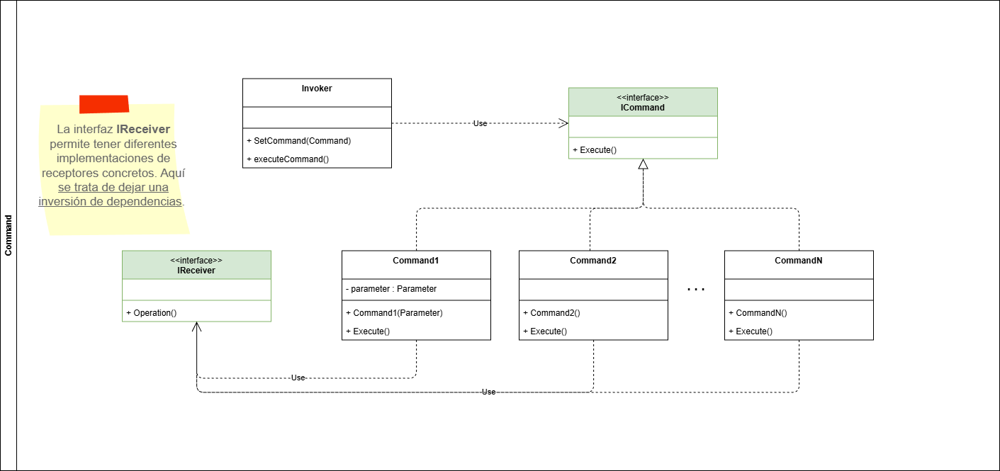

# Patrones de comportamiento

## Definición

Los patrones de comportamiento se enfocan en [la interacción y la comunicación entre los objetos](https://www.geeksforgeeks.org/system-design/behavioral-design-patterns/). Nos permiten definir cómo colaboran y cómo se distribuyen responsabilidades entre objetos.

Los patrones de comportamiento suelen facilitar el manejo de sistemas muy complejos o que tienen muchas reglas de negocio aplicadas.

## Clasificación

A continuación se desarrollan para cada uno de los patrones creacionales los siguientes items:

- Definición
- ¿Cuándo usar este patrón?
- ¿Cuales son sus componentes?
- Diagrama de clases
- Ejemplo

---

## Tabla de contenido

1. [Chain of Responsibility (CoR)](#chain-of-responsibility-cor)
2. [Command](#command)
3. [Iterator](#tabla-de-contenido)
4. [Mediator](#tabla-de-contenido)
5. [Memento](#tabla-de-contenido)
6. [Observer](#tabla-de-contenido)
7. [State](#tabla-de-contenido)
8. [Strategy](#tabla-de-contenido)
9. [Template Method](#tabla-de-contenido)
10. [Visitor](#tabla-de-contenido)

### Chain of Responsibility (CoR)

- **Definición**

El patrón **Chain of Responsibility** nos permite pasar peticionnes entre diferentes handlers que se encuentran en una cadena de procesos.Cada handler está en la potestad de evaluar si puede procesar una petición o si la delega al siguiente handler.

- **¿Cuándo usar este patrón?**

✅ **Úsalo cuando:**

- Tienes un conjunto de objetos que pueden manejar una solicitud y deseas que la solicitud pase por la cadena hasta que un objeto la procese.
- Quieres evitar el acoplamiento entre el emisor de una solicitud y su receptor.
- Deseas agregar o cambiar dinámicamente los manejadores de una solicitud sin afectar a los demás manejadores.

❌ **NO lo uses cuando:**

- El orden de los manejadores en la cadena es crítico y no puede cambiarse dinámicamente.
- Necesitas que todos los manejadores procesen la solicitud en lugar de solo uno.
- La lógica de manejo es demasiado compleja y no puede dividirse fácilmente en responsabilidades separadas.

💡 **Señal de sobreingeniería:**

- La cadena de responsabilidad tiene demasiados manejadores, lo que dificulta el seguimiento del flujo de la solicitud.
- Los manejadores tienen demasiadas dependencias entre sí, lo que rompe el principio de responsabilidad única.

- **¿Cuales son sus componentes?**

  - **IHandler**: Interfaz común entre los handlers del proceso.
  - **Concrete Handlers**: Implementación concreta de los diferentes procesos.

- **Diagrama de clases**


- **Ejemplo**

Para ejemplificar el patrón **CoR** podemos tomar el escenario de la gestión de un ticket de soporte. La solicitud para el soporte tiene diferentes tipos de criticidad (BAJA, MEDIA, ALTA, CRITICA) cada una de estas es atendida por un equipo de soporte diferente.

El patrón **Chain of Responsibility** nos permite crear cada asignación de equipo en un handler diferente, cuando llega una petición, cada handler está en la capacidad de evaluar si puede gestionar la petición o si la escala al siguiente equipo.

```csharp

public enum ESupportClassification{
    LOW,
    MEDIUM,
    HIGH,
    CRITICAL
}

public record SupportRequest(
    Guid Id, 
    DateTime Date, 
    string Title, 
    string Description, 
    ESupportClassification Classification);

public interface ISupportTaskHandler{
    void SetNext(ISupportTaskHandler nextTask);
    Task Handle(SupportRequest request);
}

public sealed class SupportBasicHandler : ISupportTaskHandler{

    private ISupportTaskHandler _nextTask;

    public void SetNext(ISupportTaskHandler nextTask){
        _nextTask = nextTask;
    }

    public async Task Handle(SupportRequest request){

        if (request.Classification != ESupportClassification.LOW)
        {
            if (_nextTask != null)
            {
                await _nextTask.Handle(request);
            }
            return;
        }
        
        // Implementa lógica para soporte de criticidad baja
        Console.WriteLine("Solución criticidad baja");
    }

}

public sealed class SupportIntermediateHandler : ISupportTaskHandler{

    private ISupportTaskHandler _nextTask;

    public void SetNext(ISupportTaskHandler nextTask){
        _nextTask = nextTask;
    }

    public async Task Handle(SupportRequest request){

        if (request.Classification != ESupportClassification.MEDIUM)
        {
            if (_nextTask != null)
            {
                await _nextTask.Handle(request);
            }
            return;
        }
        
        // Implementa lógica para soporte de criticidad intermedia
        Console.WriteLine("Solución criticidad intermedia");
    }

}

public sealed class SupportHighHandler : ISupportTaskHandler{

    private ISupportTaskHandler _nextTask;

    public void SetNext(ISupportTaskHandler nextTask){
        _nextTask = nextTask;
    }

    public async Task Handle(SupportRequest request){

        if (request.Classification != ESupportClassification.HIGH)
        {
            if (_nextTask != null)
            {
                await _nextTask.Handle(request);
            }
            return;
        }
        
        // Implementa lógica para soporte de criticidad alta
        Console.WriteLine("Solución criticidad alta");
    }

}

public sealed class SupportCriticalHandler : ISupportTaskHandler{

    public void SetNext(ISupportTaskHandler nextTask){
        // No hay un paso siguiente porque este es el último handler en la cadena
    }

    public async Task Handle(SupportRequest request){

        if (request.Classification != ESupportClassification.CRITICAL)
        {
            Console.WriteLine("No existe una criticidad más alta");
            return;
        }
        
        // Implementa lógica para soporte de criticidad crítica
        Console.WriteLine("Solución criticidad crítica");
    }

}

```

[Volver a Indice](#tabla-de-contenido)

---

### Command

- **Definición**

El patrón **Command** permite encapsular peticiones dentro de un objeto, desacoplando el Sender del Receiver. Este patrón permite que las peticiones sean pasadas como argumentos, encoladas, logueadas dentro de un historial de comandos o incluso tener operaciones reversibles.

- **¿Cuándo usar este patrón?**

✅ **Úsalo cuando:**

- Quieres encapsular una solicitud como un objeto, permitiendo parametrizar clientes con diferentes solicitudes.
- Necesitas realizar operaciones que puedan ser deshechas (deshacer/rehacer).
- Deseas mantener un historial de operaciones realizadas para poder auditarlas o repetirlas.
- Quieres desacoplar el objeto que invoca una operación del objeto que la ejecuta.

❌ **NO lo uses cuando:**

- La lógica de las operaciones es simple y no requiere ser encapsulada en objetos separados.
- No necesitas mantener un historial de operaciones ni realizar operaciones reversibles.
- El sistema no requiere flexibilidad para cambiar dinámicamente las solicitudes o comandos.

💡 **Señal de sobreingeniería:**

- Tienes demasiados comandos que son muy simples y no justifican el uso del patrón.
- La implementación del patrón introduce una complejidad innecesaria en un sistema que podría resolverse con métodos directos.
- Los comandos no son reutilizados ni se benefician de la flexibilidad que ofrece el patrón.

- **¿Cuales son sus componentes?**

  - **ICommand**: Interfaz común entre los comandos.
  - **Concrete Commands**: Implementación concreta de cada uno de los comandos.
  - **Invoker**: Se encarga de iniciar la ejecución de los comandos sin conocer los detalles.
  - **Receiver**: Ejecuta la operación definida por el comando.

- **Diagrama de clases**



- **Ejemplo**

Para dar un ejemplo sobre el patrón **Command** simularemos el siguiente escenario: Un sistema encargado de la logistica de una empresa, tiene dentro de sus operaciones despachar pedidos, generar pedidos, cancelar pedido. El patrón **Command** me permite separar cada uno de estos en comandos separados que voy a loguear en un historial y posteriormente a encolar a un broker de mensajes.

```csharp
public interface ICommand
{
    void Execute();
}

// Receiver
public class LogisticsSystem
{
    public void DispatchOrder()
    {
        Console.WriteLine("Order dispatched.");
    }

    public void GenerateOrder()
    {
        Console.WriteLine("Order generated.");
    }

    public void CancelOrder()
    {
        Console.WriteLine("Order canceled.");
    }
}

// Concrete Commands
public class DispatchOrderCommand : ICommand
{
    private readonly LogisticsSystem _logisticsSystem;

    public DispatchOrderCommand(LogisticsSystem logisticsSystem)
    {
        _logisticsSystem = logisticsSystem;
    }

    public void Execute()
    {
        _logisticsSystem.DispatchOrder();
    }
}

public class GenerateOrderCommand : ICommand
{
    private readonly LogisticsSystem _logisticsSystem;

    public GenerateOrderCommand(LogisticsSystem logisticsSystem)
    {
        _logisticsSystem = logisticsSystem;
    }

    public void Execute()
    {
        _logisticsSystem.GenerateOrder();
    }
}

public class CancelOrderCommand : ICommand
{
    private readonly LogisticsSystem _logisticsSystem;

    public CancelOrderCommand(LogisticsSystem logisticsSystem)
    {
        _logisticsSystem = logisticsSystem;
    }

    public void Execute()
    {
        _logisticsSystem.CancelOrder();
    }
}

// Invoker
public class CommandInvoker
{
    private readonly List<ICommand> _commandHistory = new();

    public void ExecuteCommand(ICommand command)
    {
        command.Execute();
        _commandHistory.Add(command);
    }

    public void ShowHistory()
    {
        Console.WriteLine("Command History:");
        foreach (var command in _commandHistory)
        {
            Console.WriteLine(command.GetType().Name);
        }
    }
}

// Example usage
class Program
{
    static void Main(string[] args)
    {
        var logisticsSystem = new LogisticsSystem();

        var dispatchCommand = new DispatchOrderCommand(logisticsSystem);
        var generateCommand = new GenerateOrderCommand(logisticsSystem);
        var cancelCommand = new CancelOrderCommand(logisticsSystem);

        var invoker = new CommandInvoker();

        invoker.ExecuteCommand(dispatchCommand);
        invoker.ExecuteCommand(generateCommand);
        invoker.ExecuteCommand(cancelCommand);

        invoker.ShowHistory();
    }
}
```

[Volver a Indice](#tabla-de-contenido)

---

### Iterator

- **Definición**

El patrón **Iterator** proporciona una forma uniforme de recorrer los elementos de una colección (como listas, pilas, colas o árboles) sin exponer su implementación interna. Este patrón utiliza un objeto iterador separado que encapsula la lógica de recorrido, permitiendo que la estructura interna de la colección pueda cambiar sin afectar la forma en que se accede a sus elementos.

- **¿Cuándo usar este patrón?**

✅ **Úsalo cuando:**

- Necesitas recorrer una colección de elementos sin exponer su estructura interna.
- Quieres proporcionar múltiples formas de recorrer una colección (por ejemplo, hacia adelante, hacia atrás, por niveles, etc.).
- Deseas unificar la forma de iterar sobre diferentes tipos de colecciones.

❌ **NO lo uses cuando:**

- La colección es simple y no requiere un objeto iterador separado para recorrerla.
- No necesitas diferentes formas de recorrer la colección.
- La colección es inmutable y no se espera que cambie su estructura interna.

💡 **Señal de sobreingeniería:**

- Creas iteradores para colecciones que no necesitan un recorrido complejo o personalizado.
- La implementación del iterador es más compleja que la propia colección.
- Existen múltiples iteradores que no aportan un valor significativo al diseño del sistema.

- **¿Cuales son sus componentes?**

  - **Iterator Collection**: Define la interfaz para crear iteradores de un objeto.
  - **Concrete Iterator Collection**: Implementación concreta de cada uno de los iteradores.
  - **Iterator**: Define la interfaz para acceder y recorrer los elementos de la colección.
  - **Concrete Iterator**: Implementación concreta para mantener la posicion actual y define las operaciones posibles del iterador.

- **Diagrama de clases**


- **Ejemplo**

```csharp

```

[Volver a Indice](#tabla-de-contenido)