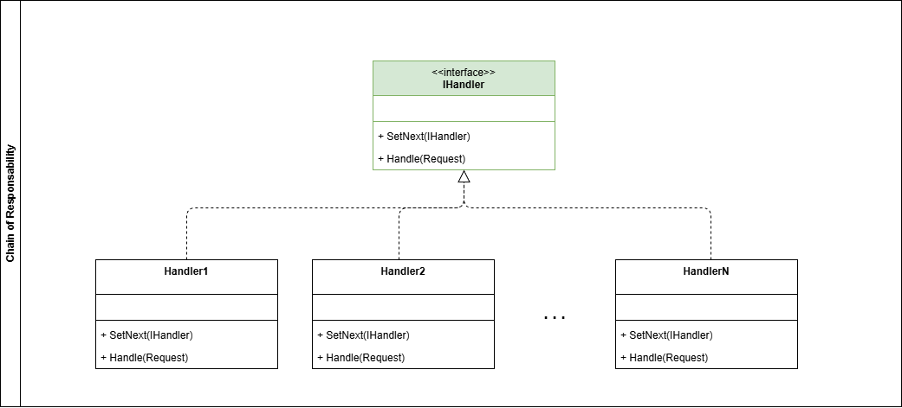

# Patrones de comportamiento

## Definición

Los patrones de comportamiento se enfocan en [la interacción y la comunicación entre los objetos](https://www.geeksforgeeks.org/system-design/behavioral-design-patterns/). Nos permiten definir cómo colaboran y cómo se distribuyen responsabilidades entre objetos.

Los patrones de comportamiento suelen facilitar el manejo de sistemas muy complejos o que tienen muchas reglas de negocio aplicadas.

## Clasificación

A continuación se desarrollan para cada uno de los patrones creacionales los siguientes items:

- Definición
- ¿Cuándo usar este patrón?
- ¿Cuales son sus componentes?
- Diagrama de clases
- Ejemplo

---

## Tabla de contenido

1. [Chain of Responsibility (CoR)](#tabla-de-contenido)
2. [Command](#tabla-de-contenido)
3. [Iterator](#tabla-de-contenido)
4. [Mediator](#tabla-de-contenido)
5. [Memento](#tabla-de-contenido)
6. [Observer](#tabla-de-contenido)
7. [State](#tabla-de-contenido)
8. [Strategy](#tabla-de-contenido)
9. [Template Method](#tabla-de-contenido)
10. [Visitor](#tabla-de-contenido)

### Chain of Responsibility (CoR)

- **Definición**

El patrón **Chain of Responsibility** nos permite pasar peticionnes entre diferentes handlers que se encuentran en una cadena de procesos.Cada handler está en la potestad de evaluar si puede procesar una petición o si la delega al siguiente handler.

- **¿Cuándo usar este patrón?**

✅ **Úsalo cuando:**

- Tienes un conjunto de objetos que pueden manejar una solicitud y deseas que la solicitud pase por la cadena hasta que un objeto la procese.
- Quieres evitar el acoplamiento entre el emisor de una solicitud y su receptor.
- Deseas agregar o cambiar dinámicamente los manejadores de una solicitud sin afectar a los demás manejadores.

❌ **NO lo uses cuando:**

- El orden de los manejadores en la cadena es crítico y no puede cambiarse dinámicamente.
- Necesitas que todos los manejadores procesen la solicitud en lugar de solo uno.
- La lógica de manejo es demasiado compleja y no puede dividirse fácilmente en responsabilidades separadas.

💡 **Señal de sobreingeniería:**

- La cadena de responsabilidad tiene demasiados manejadores, lo que dificulta el seguimiento del flujo de la solicitud.
- Los manejadores tienen demasiadas dependencias entre sí, lo que rompe el principio de responsabilidad única.

- **¿Cuales son sus componentes?**

  - **IHandler**: Interfaz común entre los handlers del proceso.
  - **Concrete Handlers**: Implementación concreta de los diferentes procesos.

- **Diagrama de clases**



- **Ejemplo**

Para ejemplificar el patrón **CoR** podemos tomar el escenario de la gestión de un ticket de soporte. La solicitud para el soporte tiene diferentes tipos de criticidad (BAJA, MEDIA, ALTA, CRITICA) cada una de estas es atendida por un equipo de soporte diferente.

El patrón **Chain of Responsibility** nos permite crear cada asignación de equipo en un handler diferente, cuando llega una petición, cada handler está en la capacidad de evaluar si puede gestionar la petición o si la escala al siguiente equipo.

```csharp

public enum ESupportClassification{
    LOW,
    MEDIUM,
    HIGH,
    CRITICAL
}

public record SupportRequest(
    Guid Id, 
    DateTime Date, 
    string Title, 
    string Description, 
    ESupportClassification Classification);

public interface ISupportTaskHandler{
    void SetNext(ISupportTaskHandler nextTask);
    Task Handle(SupportRequest request);
}

public sealed class SupportBasicHandler : ISupportTaskHandler{

    private ISupportTaskHandler _nextTask;

    public void SetNext(ISupportTaskHandler nextTask){
        _nextTask = nextTask;
    }

    public async Task Handle(SupportRequest request){

        if (request.Classification != ESupportClassification.LOW)
        {
            if (_nextTask != null)
            {
                await _nextTask.Handle(request);
            }
            return;
        }
        
        // Implementa lógica para soporte de criticidad baja
        Console.WriteLine("Solución criticidad baja");
    }

}

public sealed class SupportIntermediateHandler : ISupportTaskHandler{

    private ISupportTaskHandler _nextTask;

    public void SetNext(ISupportTaskHandler nextTask){
        _nextTask = nextTask;
    }

    public async Task Handle(SupportRequest request){

        if (request.Classification != ESupportClassification.MEDIUM)
        {
            if (_nextTask != null)
            {
                await _nextTask.Handle(request);
            }
            return;
        }
        
        // Implementa lógica para soporte de criticidad intermedia
        Console.WriteLine("Solución criticidad intermedia");
    }

}

public sealed class SupportHighHandler : ISupportTaskHandler{

    private ISupportTaskHandler _nextTask;

    public void SetNext(ISupportTaskHandler nextTask){
        _nextTask = nextTask;
    }

    public async Task Handle(SupportRequest request){

        if (request.Classification != ESupportClassification.HIGH)
        {
            if (_nextTask != null)
            {
                await _nextTask.Handle(request);
            }
            return;
        }
        
        // Implementa lógica para soporte de criticidad alta
        Console.WriteLine("Solución criticidad alta");
    }

}

public sealed class SupportCriticalHandler : ISupportTaskHandler{

    public void SetNext(ISupportTaskHandler nextTask){
        // No hay un paso siguiente porque este es el último handler en la cadena
    }

    public async Task Handle(SupportRequest request){

        if (request.Classification != ESupportClassification.CRITICAL)
        {
            Console.WriteLine("No existe una criticidad más alta");
            return;
        }
        
        // Implementa lógica para soporte de criticidad crítica
        Console.WriteLine("Solución criticidad crítica");
    }

}

```

[Volver a Indice](#tabla-de-contenido)

---
