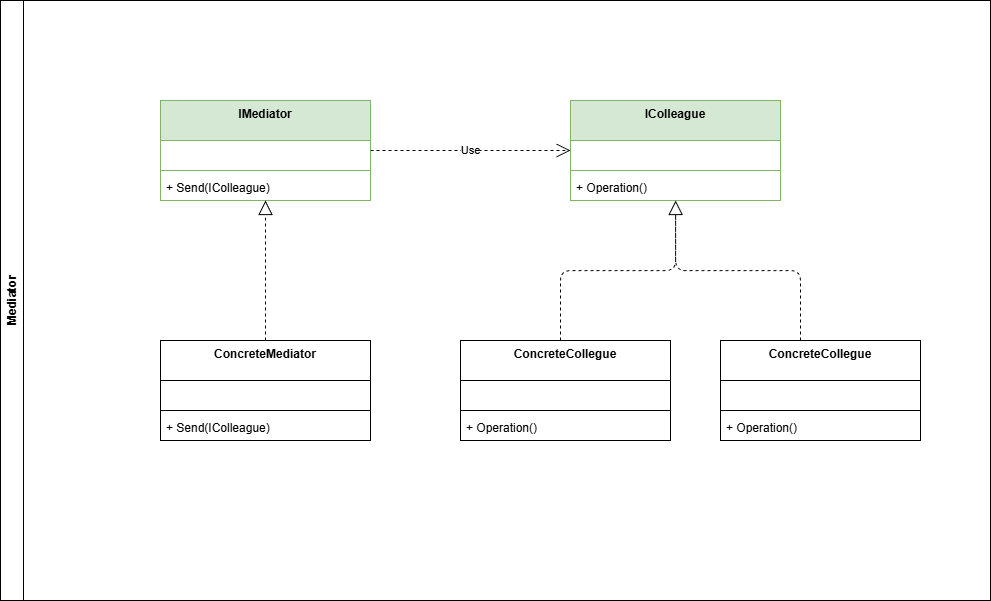
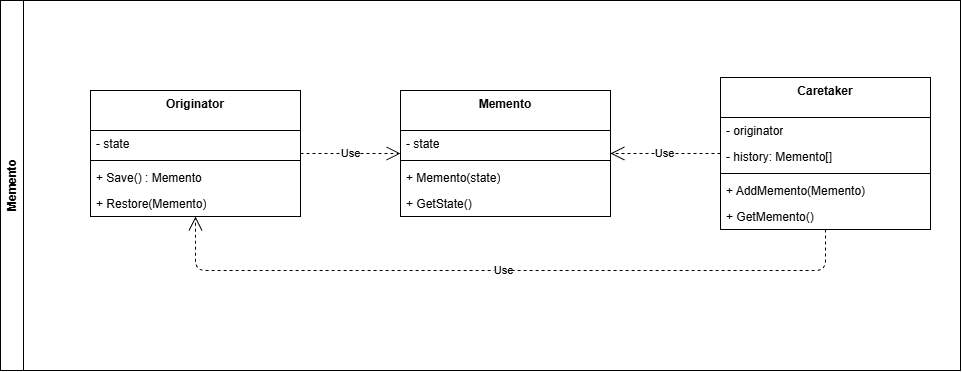
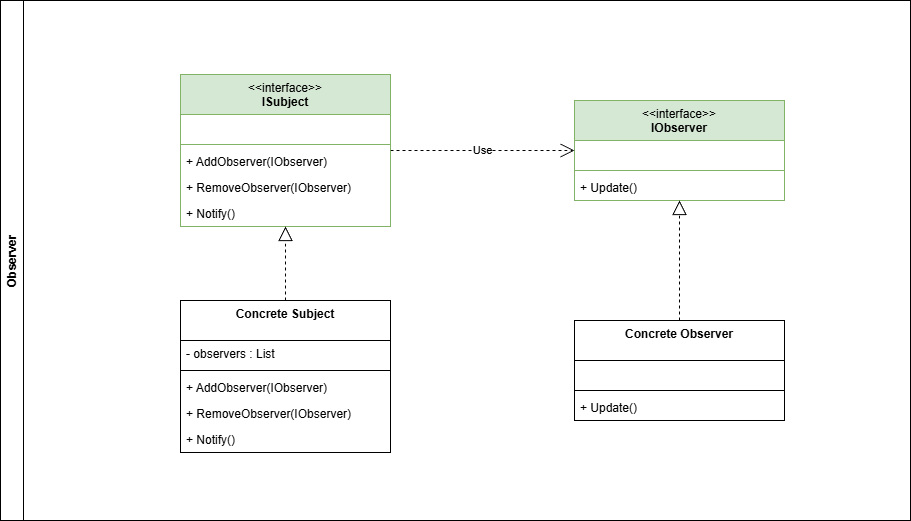

# Patrones de comportamiento

## Definición

Los patrones de comportamiento se enfocan en [la interacción y la comunicación entre los objetos](https://www.geeksforgeeks.org/system-design/behavioral-design-patterns/). Nos permiten definir cómo colaboran y cómo se distribuyen responsabilidades entre objetos.

Los patrones de comportamiento suelen facilitar el manejo de sistemas muy complejos o que tienen muchas reglas de negocio aplicadas.

## Clasificación

A continuación se desarrollan para cada uno de los patrones creacionales los siguientes items:

- Definición
- ¿Cuándo usar este patrón?
- ¿Cuales son sus componentes?
- Diagrama de clases
- Ejemplo

---

## Tabla de contenido

1. [Chain of Responsibility (CoR)](#chain-of-responsibility-cor)
2. [Command](#command)
3. [Iterator](#iterator)
4. [Mediator](#mediator)
5. [Memento](#memento)
6. [Observer](#observer)
7. [State](#tabla-de-contenido)
8. [Strategy](#tabla-de-contenido)
9. [Template Method](#tabla-de-contenido)
10. [Visitor](#tabla-de-contenido)

### Chain of Responsibility (CoR)

- **Definición**

El patrón **Chain of Responsibility** nos permite pasar peticionnes entre diferentes handlers que se encuentran en una cadena de procesos.Cada handler está en la potestad de evaluar si puede procesar una petición o si la delega al siguiente handler.

- **¿Cuándo usar este patrón?**

✅ **Úsalo cuando:**

- Tienes un conjunto de objetos que pueden manejar una solicitud y deseas que la solicitud pase por la cadena hasta que un objeto la procese.
- Quieres evitar el acoplamiento entre el emisor de una solicitud y su receptor.
- Deseas agregar o cambiar dinámicamente los manejadores de una solicitud sin afectar a los demás manejadores.

❌ **NO lo uses cuando:**

- El orden de los manejadores en la cadena es crítico y no puede cambiarse dinámicamente.
- Necesitas que todos los manejadores procesen la solicitud en lugar de solo uno.
- La lógica de manejo es demasiado compleja y no puede dividirse fácilmente en responsabilidades separadas.

💡 **Señal de sobreingeniería:**

- La cadena de responsabilidad tiene demasiados manejadores, lo que dificulta el seguimiento del flujo de la solicitud.
- Los manejadores tienen demasiadas dependencias entre sí, lo que rompe el principio de responsabilidad única.

- **¿Cuales son sus componentes?**

  - **IHandler**: Interfaz común entre los handlers del proceso.
  - **Concrete Handlers**: Implementación concreta de los diferentes procesos.

- **Diagrama de clases**


- **Ejemplo**

Para ejemplificar el patrón **CoR** podemos tomar el escenario de la gestión de un ticket de soporte. La solicitud para el soporte tiene diferentes tipos de criticidad (BAJA, MEDIA, ALTA, CRITICA) cada una de estas es atendida por un equipo de soporte diferente.

El patrón **Chain of Responsibility** nos permite crear cada asignación de equipo en un handler diferente, cuando llega una petición, cada handler está en la capacidad de evaluar si puede gestionar la petición o si la escala al siguiente equipo.

```csharp

public enum ESupportClassification{
    LOW,
    MEDIUM,
    HIGH,
    CRITICAL
}

public record SupportRequest(
    Guid Id, 
    DateTime Date, 
    string Title, 
    string Description, 
    ESupportClassification Classification);

public interface ISupportTaskHandler{
    void SetNext(ISupportTaskHandler nextTask);
    Task Handle(SupportRequest request);
}

public sealed class SupportBasicHandler : ISupportTaskHandler{

    private ISupportTaskHandler _nextTask;

    public void SetNext(ISupportTaskHandler nextTask){
        _nextTask = nextTask;
    }

    public async Task Handle(SupportRequest request){

        if (request.Classification != ESupportClassification.LOW)
        {
            if (_nextTask != null)
            {
                await _nextTask.Handle(request);
            }
            return;
        }
        
        // Implementa lógica para soporte de criticidad baja
        Console.WriteLine("Solución criticidad baja");
    }

}

public sealed class SupportIntermediateHandler : ISupportTaskHandler{

    private ISupportTaskHandler _nextTask;

    public void SetNext(ISupportTaskHandler nextTask){
        _nextTask = nextTask;
    }

    public async Task Handle(SupportRequest request){

        if (request.Classification != ESupportClassification.MEDIUM)
        {
            if (_nextTask != null)
            {
                await _nextTask.Handle(request);
            }
            return;
        }
        
        // Implementa lógica para soporte de criticidad intermedia
        Console.WriteLine("Solución criticidad intermedia");
    }

}

public sealed class SupportHighHandler : ISupportTaskHandler{

    private ISupportTaskHandler _nextTask;

    public void SetNext(ISupportTaskHandler nextTask){
        _nextTask = nextTask;
    }

    public async Task Handle(SupportRequest request){

        if (request.Classification != ESupportClassification.HIGH)
        {
            if (_nextTask != null)
            {
                await _nextTask.Handle(request);
            }
            return;
        }
        
        // Implementa lógica para soporte de criticidad alta
        Console.WriteLine("Solución criticidad alta");
    }

}

public sealed class SupportCriticalHandler : ISupportTaskHandler{

    public void SetNext(ISupportTaskHandler nextTask){
        // No hay un paso siguiente porque este es el último handler en la cadena
    }

    public async Task Handle(SupportRequest request){

        if (request.Classification != ESupportClassification.CRITICAL)
        {
            Console.WriteLine("No existe una criticidad más alta");
            return;
        }
        
        // Implementa lógica para soporte de criticidad crítica
        Console.WriteLine("Solución criticidad crítica");
    }

}

```

[Volver a Indice](#tabla-de-contenido)

---

### Command

- **Definición**

El patrón **Command** permite encapsular peticiones dentro de un objeto, desacoplando el Sender del Receiver. Este patrón permite que las peticiones sean pasadas como argumentos, encoladas, logueadas dentro de un historial de comandos o incluso tener operaciones reversibles.

- **¿Cuándo usar este patrón?**

✅ **Úsalo cuando:**

- Quieres encapsular una solicitud como un objeto, permitiendo parametrizar clientes con diferentes solicitudes.
- Necesitas realizar operaciones que puedan ser deshechas (deshacer/rehacer).
- Deseas mantener un historial de operaciones realizadas para poder auditarlas o repetirlas.
- Quieres desacoplar el objeto que invoca una operación del objeto que la ejecuta.

❌ **NO lo uses cuando:**

- La lógica de las operaciones es simple y no requiere ser encapsulada en objetos separados.
- No necesitas mantener un historial de operaciones ni realizar operaciones reversibles.
- El sistema no requiere flexibilidad para cambiar dinámicamente las solicitudes o comandos.

💡 **Señal de sobreingeniería:**

- Tienes demasiados comandos que son muy simples y no justifican el uso del patrón.
- La implementación del patrón introduce una complejidad innecesaria en un sistema que podría resolverse con métodos directos.
- Los comandos no son reutilizados ni se benefician de la flexibilidad que ofrece el patrón.

- **¿Cuales son sus componentes?**

  - **ICommand**: Interfaz común entre los comandos.
  - **Concrete Commands**: Implementación concreta de cada uno de los comandos.
  - **Invoker**: Se encarga de iniciar la ejecución de los comandos sin conocer los detalles.
  - **Receiver**: Ejecuta la operación definida por el comando.

- **Diagrama de clases**


- **Ejemplo**

Para dar un ejemplo sobre el patrón **Command** simularemos el siguiente escenario: Un sistema encargado de la logistica de una empresa, tiene dentro de sus operaciones despachar pedidos, generar pedidos, cancelar pedido. El patrón **Command** me permite separar cada uno de estos en comandos separados que voy a loguear en un historial y posteriormente a encolar a un broker de mensajes.

```csharp
public interface ICommand
{
    void Execute();
}

// Receiver
public class LogisticsSystem
{
    public void DispatchOrder()
    {
        Console.WriteLine("Order dispatched.");
    }

    public void GenerateOrder()
    {
        Console.WriteLine("Order generated.");
    }

    public void CancelOrder()
    {
        Console.WriteLine("Order canceled.");
    }
}

// Concrete Commands
public class DispatchOrderCommand : ICommand
{
    private readonly LogisticsSystem _logisticsSystem;

    public DispatchOrderCommand(LogisticsSystem logisticsSystem)
    {
        _logisticsSystem = logisticsSystem;
    }

    public void Execute()
    {
        _logisticsSystem.DispatchOrder();
    }
}

public class GenerateOrderCommand : ICommand
{
    private readonly LogisticsSystem _logisticsSystem;

    public GenerateOrderCommand(LogisticsSystem logisticsSystem)
    {
        _logisticsSystem = logisticsSystem;
    }

    public void Execute()
    {
        _logisticsSystem.GenerateOrder();
    }
}

public class CancelOrderCommand : ICommand
{
    private readonly LogisticsSystem _logisticsSystem;

    public CancelOrderCommand(LogisticsSystem logisticsSystem)
    {
        _logisticsSystem = logisticsSystem;
    }

    public void Execute()
    {
        _logisticsSystem.CancelOrder();
    }
}

// Invoker
public class CommandInvoker
{
    private readonly List<ICommand> _commandHistory = new();

    public void ExecuteCommand(ICommand command)
    {
        command.Execute();
        _commandHistory.Add(command);
    }

    public void ShowHistory()
    {
        Console.WriteLine("Command History:");
        foreach (var command in _commandHistory)
        {
            Console.WriteLine(command.GetType().Name);
        }
    }
}

// Example usage
class Program
{
    static void Main(string[] args)
    {
        var logisticsSystem = new LogisticsSystem();

        var dispatchCommand = new DispatchOrderCommand(logisticsSystem);
        var generateCommand = new GenerateOrderCommand(logisticsSystem);
        var cancelCommand = new CancelOrderCommand(logisticsSystem);

        var invoker = new CommandInvoker();

        invoker.ExecuteCommand(dispatchCommand);
        invoker.ExecuteCommand(generateCommand);
        invoker.ExecuteCommand(cancelCommand);

        invoker.ShowHistory();
    }
}
```

[Volver a Indice](#tabla-de-contenido)

---

### Iterator

- **Definición**

El patrón **Iterator** proporciona una forma uniforme de recorrer los elementos de una colección (como listas, pilas, colas o árboles) sin exponer su implementación interna. Este patrón utiliza un objeto iterador separado que encapsula la lógica de recorrido, permitiendo que la estructura interna de la colección pueda cambiar sin afectar la forma en que se accede a sus elementos.

- **¿Cuándo usar este patrón?**

✅ **Úsalo cuando:**

- Necesitas recorrer una colección de elementos sin exponer su estructura interna.
- Quieres proporcionar múltiples formas de recorrer una colección (por ejemplo, hacia adelante, hacia atrás, por niveles, etc.).
- Deseas unificar la forma de iterar sobre diferentes tipos de colecciones.

❌ **NO lo uses cuando:**

- La colección es simple y no requiere un objeto iterador separado para recorrerla.
- No necesitas diferentes formas de recorrer la colección.
- La colección es inmutable y no se espera que cambie su estructura interna.

💡 **Señal de sobreingeniería:**

- Creas iteradores para colecciones que no necesitan un recorrido complejo o personalizado.
- La implementación del iterador es más compleja que la propia colección.
- Existen múltiples iteradores que no aportan un valor significativo al diseño del sistema.

- **¿Cuales son sus componentes?**

  - **Iterable Collection**: Define la interfaz para crear iteradores de un objeto.
  - **Concrete Iterable Collection**: Implementación concreta de cada uno de los iteradores.
  - **Iterator**: Define la interfaz para acceder y recorrer los elementos de la colección.
  - **Concrete Iterator**: Implementación concreta para mantener la posicion actual y define las operaciones posibles del iterador.

- **Diagrama de clases**


- **Ejemplo**

Para ejemplificar el patrón **Iterator** imaginemos que dentro del sistema tenemos una coleccion de productos, los cuales tienen diferentes formas de recorrerse dependiendo de la funcionalidad seleccionada. Listar productos nuevos permite recorrer los productos en orden descendente a su fecha de creacion. Listar productos con poco stock permite recorrer los productos que tienen menor stock y puede que en el futuro se implementen más tipos de llamados.

```csharp
// Producto
public class Producto
{
    public string Nombre { get; set; }
    public DateTime FechaCreacion { get; set; }
    public int Stock { get; set; }

    public Producto(string nombre, DateTime fechaCreacion, int stock)
    {
        Nombre = nombre;
        FechaCreacion = fechaCreacion;
        Stock = stock;
    }
}

// Interfaz Iterator
public interface IIterator<T>
{
    bool HasNext();
    T Next();
}

// Interfaz Iterable Collection
public interface IProductoCollection
{
    IIterator<Producto> CreateFechaCreacionIterator();
    IIterator<Producto> CreateStockIterator();
}

// Implementación concreta de la colección
public class ProductoCollection : IProductoCollection
{
    private List<Producto> _productos = new();

    public void AddProducto(Producto producto)
    {
        _productos.Add(producto);
    }

    public IIterator<Producto> CreateFechaCreacionIterator()
    {
        return new FechaCreacionIterator(_productos);
    }

    public IIterator<Producto> CreateStockIterator()
    {
        return new StockIterator(_productos);
    }
}

// Implementación concreta del iterador por fecha de creación
public class FechaCreacionIterator : IIterator<Producto>
{
    private readonly List<Producto> _productos;
    private int _position;

    public FechaCreacionIterator(List<Producto> productos)
    {
        _productos = productos.OrderByDescending(p => p.FechaCreacion).ToList();
        _position = 0;
    }

    public bool HasNext()
    {
        return _position < _productos.Count;
    }

    public Producto Next()
    {
        return _productos[_position++];
    }
}

// Implementación concreta del iterador por stock
public class StockIterator : IIterator<Producto>
{
    private readonly List<Producto> _productos;
    private int _position;

    public StockIterator(List<Producto> productos)
    {
        _productos = productos.OrderBy(p => p.Stock).ToList();
        _position = 0;
    }

    public bool HasNext()
    {
        return _position < _productos.Count;
    }

    public Producto Next()
    {
        return _productos[_position++];
    }
}

// Ejemplo de uso
class Program
{
    static void Main(string[] args)
    {
        var productos = new ProductoCollection();
        productos.AddProducto(new Producto("Producto A", new DateTime(2026, 1, 1), 50));
        productos.AddProducto(new Producto("Producto B", new DateTime(2026, 2, 1), 20));
        productos.AddProducto(new Producto("Producto C", new DateTime(2025, 12, 1), 100));

        Console.WriteLine("Recorrido por fecha de creación (descendente):");
        var fechaIterator = productos.CreateFechaCreacionIterator();
        while (fechaIterator.HasNext())
        {
            var producto = fechaIterator.Next();
            Console.WriteLine($"{producto.Nombre} - {producto.FechaCreacion}");
        }

        Console.WriteLine("\nRecorrido por stock (ascendente):");
        var stockIterator = productos.CreateStockIterator();
        while (stockIterator.HasNext())
        {
            var producto = stockIterator.Next();
            Console.WriteLine($"{producto.Nombre} - Stock: {producto.Stock}");
        }
    }
}
```

[Volver a Indice](#tabla-de-contenido)

---

## Mediator

- **Definición**

El patrón **Mediator** nos permite simplificar la comunicación entre los objetos quitando el caos de dependencias y reemplazándolo por un objeto mediador. Todos los objetos se deben comunicar a través del mediador.

- **¿Cuándo usar este patrón?**

✅ **Úsalo cuando:**

- Tienes múltiples objetos que necesitan comunicarse entre sí, pero deseas evitar dependencias directas entre ellos.
- Quieres centralizar la lógica de comunicación o control entre varios objetos en un único lugar.
- Deseas facilitar el mantenimiento y la escalabilidad del sistema al reducir el acoplamiento entre los objetos.

❌ **NO lo uses cuando:**

- Los objetos pueden comunicarse directamente sin generar un acoplamiento excesivo.
- El mediador se convierte en un punto único de fallo o se vuelve demasiado complejo debido a la cantidad de lógica que maneja.
- El sistema es simple y no requiere una estructura centralizada para la comunicación.

💡 **Señal de sobreingeniería:**

- El mediador se convierte en una clase monolítica que gestiona demasiada lógica, dificultando su mantenimiento.
- Los objetos dependen excesivamente del mediador, perdiendo su independencia y flexibilidad.
- Se utiliza el patrón en un sistema donde las dependencias directas entre objetos son mínimas y no generan problemas.

- **¿Cuales son sus componentes?**

  - **Mediator**: Define el contrato de comunicación.
  - **Concrete Mediator**: Implementación concreta del mediador, facilitando la comunicacion entre objetos Colleague.
  - **Colleague**: Interfaz que define las clases que se van a comunicar.
  - **Concrete Colleague**: Implementación concreta de la clase que se va a comunicar. Este objeto delega la comunicación al mediador.

- **Diagrama de clases**



- **Ejemplo**

El patrón **Mediator** se puede ejemplificar usando el siguiente escenario: Una compañía tiene dentro de su operación varías areas encargadas de llevar a cabo un pedido del cliente. El área comercial se encarga de tomar el pedido del cliente, el área de almacenamiento organiza los productos y embala el pedido, el area de transporte se encarga de llevarlo al cliente. Para que esta operación salga bien, cada área debe comunicar a los demás el estado de su proceso.

Usando el patrón **Mediator** se sustituyen las dependencias entre áreas y se asigna a una clase mediadora que ayuda a validar los estados, activar o desactivas procesos.

```csharp
// Interfaz del Mediador
public interface IMediator
{
    void Notify(object sender, string eventMessage);
}

// Clase Mediador Concreto
public class OrderMediator : IMediator
{
    private Commercial _commercial;
    private Storage _storage;
    private Transport _transport;

    public void SetCommercial(Commercial commercial)
    {
        _commercial = commercial;
        _commercial.SetMediator(this);
    }

    public void SetStorage(Storage storage)
    {
        _storage = storage;
        _storage.SetMediator(this);
    }

    public void SetTransport(Transport transport)
    {
        _transport = transport;
        _transport.SetMediator(this);
    }

    public void Notify(object sender, string eventMessage)
    {
        if (eventMessage == "OrderReceived")
        {
            Console.WriteLine("Mediator: Comercial ha recibido un pedido. Notificando a Almacenamiento...");
            _storage.PrepareOrder();
        }
        else if (eventMessage == "OrderPrepared")
        {
            Console.WriteLine("Mediator: Almacenamiento ha preparado el pedido. Notificando a Transporte...");
            _transport.DeliverOrder();
        }
        else if (eventMessage == "OrderDelivered")
        {
            Console.WriteLine("Mediator: Transporte ha entregado el pedido. Operación completada.");
        }
    }
}

// Interfaz Colleague
public abstract class Department
{
    protected IMediator _mediator;

    public void SetMediator(IMediator mediator)
    {
        _mediator = mediator;
    }
}

// Clase Comercial (Concrete Colleague)
public class Commercial : Department
{
    public void ReceiveOrder()
    {
        Console.WriteLine("Comercial: Pedido recibido del cliente.");
        _mediator.Notify(this, "OrderReceived");
    }
}

// Clase Almacenamiento (Concrete Colleague)
public class Storage : Department
{
    public void PrepareOrder()
    {
        Console.WriteLine("Almacenamiento: Preparando y embalando el pedido.");
        _mediator.Notify(this, "OrderPrepared");
    }
}

// Clase Transporte (Concrete Colleague)
public class Transport : Department
{
    public void DeliverOrder()
    {
        Console.WriteLine("Transporte: Entregando el pedido al cliente.");
        _mediator.Notify(this, "OrderDelivered");
    }
}

// Ejemplo de uso
class Program
{
    static void Main(string[] args)
    {
        // Crear el mediador
        var mediator = new OrderMediator();

        // Crear los departamentos
        var commercial = new Commercial();
        var storage = new Storage();
        var transport = new Transport();

        // Configurar el mediador con los departamentos
        mediator.SetCommercial(commercial);
        mediator.SetStorage(storage);
        mediator.SetTransport(transport);

        // Iniciar el proceso desde el área comercial
        commercial.ReceiveOrder();
    }
}
```

[Volver a Indice](#tabla-de-contenido)

---

## Memento

- **Definición**

El patrón **Memento** permite realizar una captura del estado actual de un objeto sin la necesidad de exponer sus detalles internos. Esta captura es guardada con el objetivo de poder restaurar versiones anteriores del objeto.

- **¿Cuándo usar este patrón?**

✅ **Úsalo cuando:**

- Necesitas guardar el estado de un objeto para restaurarlo más tarde.
- Quieres implementar una funcionalidad de deshacer/rehacer en tu aplicación.
- Deseas evitar exponer detalles internos del estado de un objeto.

❌ **NO lo uses cuando:**

- El almacenamiento del estado completo del objeto es demasiado costoso en términos de memoria.
- No necesitas restaurar estados previos del objeto.
- El estado del objeto puede ser reconstruido fácilmente sin necesidad de un memento.

💡 **Señal de sobreingeniería:**

- Estás almacenando demasiados mementos, lo que consume una cantidad excesiva de memoria.
- El sistema no requiere realmente la funcionalidad de deshacer/rehacer, pero se implementa de todos modos.
- Los mementos contienen demasiada información, lo que complica su gestión y mantenimiento.

- **¿Cuales son sus componentes?**

  - **Originator**: Este es el encargado de crear y mantener el estado de un objeto. Se comunica directamente con el memento para crear una captura del estado actual.
  - **Memento**: Almacena el estado actual del Originator en un punto determinado de tiempo. Solo provee una forma de retornar el estado sin realizar cambios directos.
  - **Caretaker**: Es el responsable de almacenar y hacer un registro de los objetos Mementos. No conoce los detalles del estado, su función es almacenar o pedir mementos desde el Originator para restaurar versiones o deshacer cambios.

- **Diagrama de clases**



- **Ejemplo**

Uno de los ejemplos más usados para representar el beneficio del patrón **Memento** suele ser un editor de texto o un video juego ya que estos tienen la posibilidad de restaurar y deshacer comportamientos. Para este caso en particular utilizaremos el video juego.

Supongamos que tenemos un personaje que a medida que avanza el video juego va adquiriendo objetos en el inventario, dentro del juego hay checkpoints ya que si algo le llega a pasar al personaje, es posible reaparecer con el estado del último checkpoint.

```csharp
public class GameCharacter
{
    public string Name { get; private set; }
    public int Health { get; private set; }
    public List<string> Inventory { get; private set; }

    public GameCharacter(string name)
    {
        Name = name;
        Health = 100;
        Inventory = new List<string>();
    }

    public void AddToInventory(string item)
    {
        Inventory.Add(item);
    }

    public void ReduceHealth(int damage)
    {
        Health -= damage;
    }

    public CharacterMemento SaveState()
    {
        return new CharacterMemento(Name, Health, new List<string>(Inventory));
    }

    public void RestoreState(CharacterMemento memento)
    {
        Name = memento.Name;
        Health = memento.Health;
        Inventory = new List<string>(memento.Inventory);
    }

    public override string ToString()
    {
        return $"Name: {Name}, Health: {Health}, Inventory: [{string.Join(", ", Inventory)}]";
    }
}

public class CharacterMemento
{
    public string Name { get; }
    public int Health { get; }
    public List<string> Inventory { get; }

    public CharacterMemento(string name, int health, List<string> inventory)
    {
        Name = name;
        Health = health;
        Inventory = inventory;
    }
}

public class CheckpointManager
{
    private readonly Stack<CharacterMemento> _checkpoints = new();

    public void SaveCheckpoint(CharacterMemento memento)
    {
        _checkpoints.Push(memento);
    }

    public CharacterMemento RestoreCheckpoint()
    {
        return _checkpoints.Count > 0 ? _checkpoints.Pop() : null;
    }
}

// Ejemplo de uso
class Program
{
    static void Main(string[] args)
    {
        var character = new GameCharacter("Hero");
        var checkpointManager = new CheckpointManager();

        character.AddToInventory("Sword");
        checkpointManager.SaveCheckpoint(character.SaveState());

        character.AddToInventory("Shield");
        character.ReduceHealth(50);
        checkpointManager.SaveCheckpoint(character.SaveState());

        character.AddToInventory("Potion");
        character.ReduceHealth(30);

        Console.WriteLine("Estado actual del personaje:");
        Console.WriteLine(character);

        Console.WriteLine("\nRestaurando al último checkpoint...");
        character.RestoreState(checkpointManager.RestoreCheckpoint());
        Console.WriteLine(character);

        Console.WriteLine("\nRestaurando al checkpoint inicial...");
        character.RestoreState(checkpointManager.RestoreCheckpoint());
        Console.WriteLine(character);
    }
}
```

[Volver a Indice](#tabla-de-contenido)

---

## Observer

- **Definición**

El patrón de comportamiento **Observer** permite crear una relación de uno a muchos, definiendo un mecanismo de subscripción para notificar a muchos objetos cuando ocurra un evento en el objeto observado. Una vez el estado actual del objeto observado cambie, todos los observadores son notificados para asegurar una comunicación sincronizada.

- **¿Cuándo usar este patrón?**

✅ **Úsalo cuando:**

- Necesitas notificar a múltiples objetos sobre cambios en el estado de otro objeto.
- Quieres asegurar que los objetos dependientes estén sincronizados automáticamente con el estado del objeto observado.
- Deseas implementar un sistema de eventos donde los suscriptores puedan registrarse y recibir notificaciones de cambios.

❌ **NO lo uses cuando:**

- Hay una relación de dependencia compleja entre los observadores y el sujeto, lo que puede dificultar el mantenimiento.
- El número de observadores es muy grande y puede afectar el rendimiento del sistema debido a la cantidad de notificaciones.
- Los observadores necesitan saber demasiado sobre el estado interno del sujeto para reaccionar adecuadamente.

💡 **Señal de sobreingeniería:**

- Tienes pocos observadores o ninguno, lo que hace innecesario el uso del patrón.
- La implementación del patrón introduce una complejidad innecesaria en un sistema simple.
- Los observadores no reaccionan de manera significativa a los cambios del sujeto, lo que indica que el patrón no está aportando valor.

- **¿Cuales son sus componentes?**

  - **Subject**: Interfaz que promueve los métodos para agregar, remover y notificar observadores. Contiene una lista de observadores.
  - **Observer**: Interfaz común que deben implementar todos los observadores con un método Update() que permite actualizar todos los observadores de forma sincronizada.
  - **Concrete Subjects**: Implementación concreta de la interfaz subject, cuando un estado cambia, se encarga de notificar a todos los observadores.
  - **Concrete Observers**: Implementación concreta de la interfaz observer, se encarga de reaccionar al evento publicado por el sujeto.

- **Diagrama de clases**



- **Ejemplo**

```csharp

```

[Volver a Indice](#tabla-de-contenido)

---
