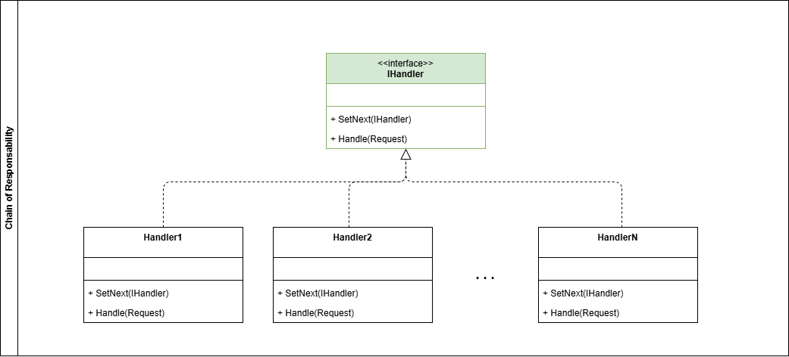
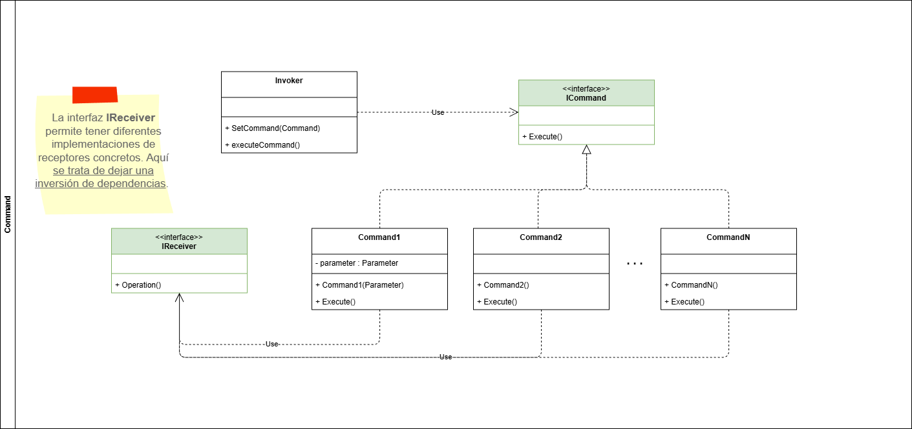
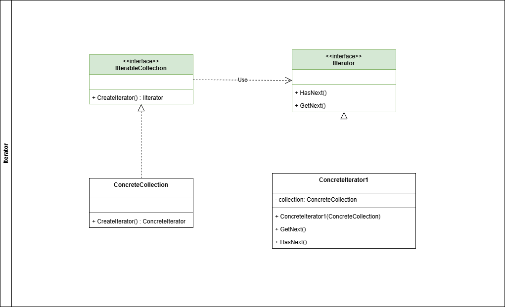
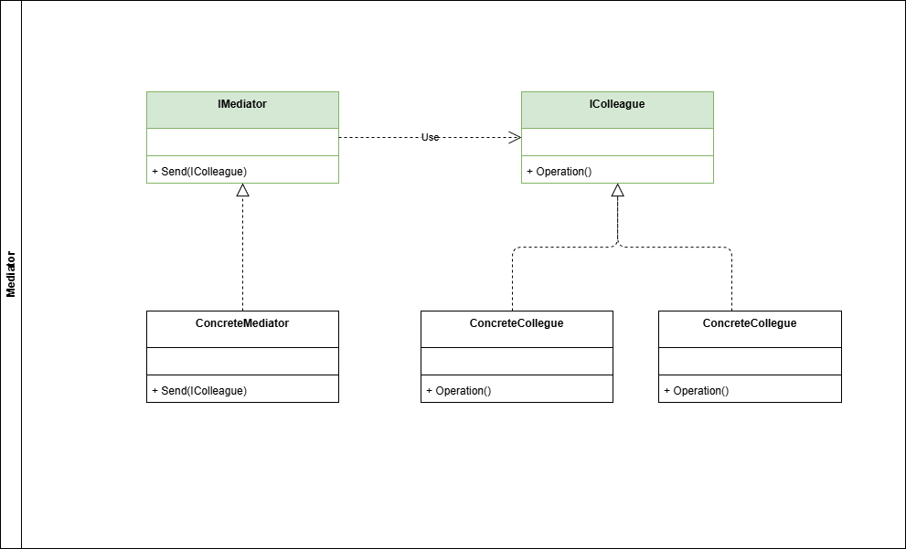
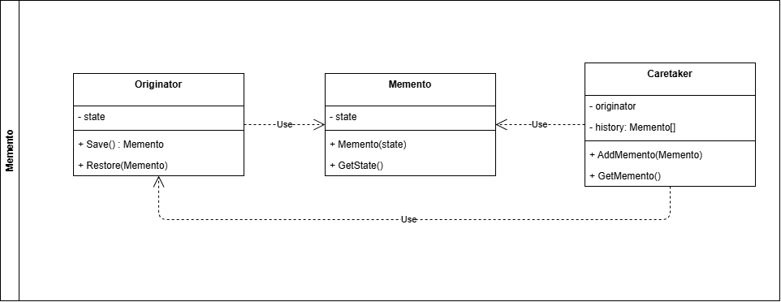
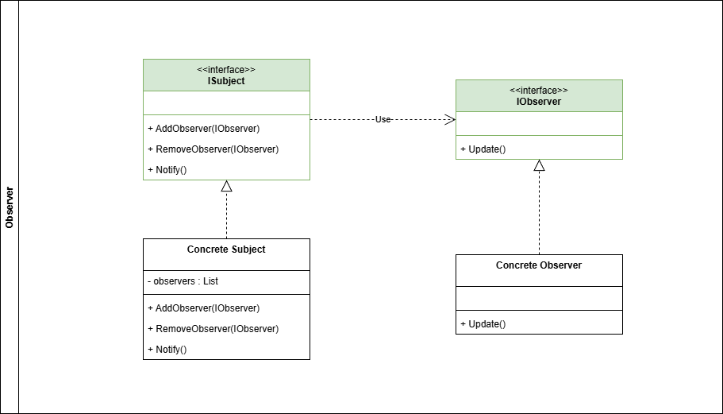
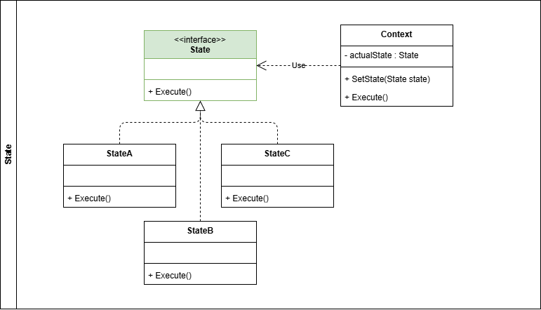
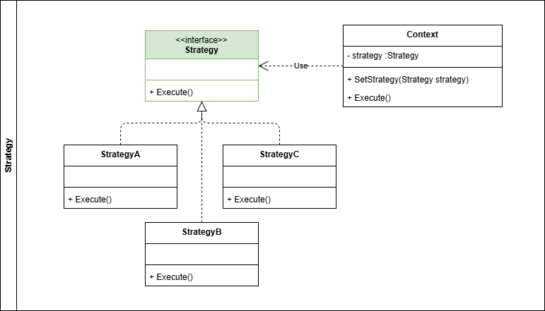
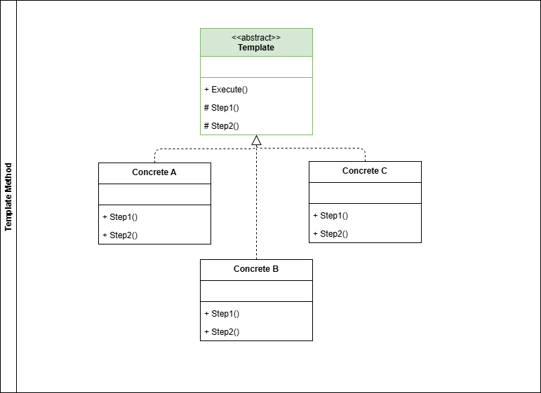
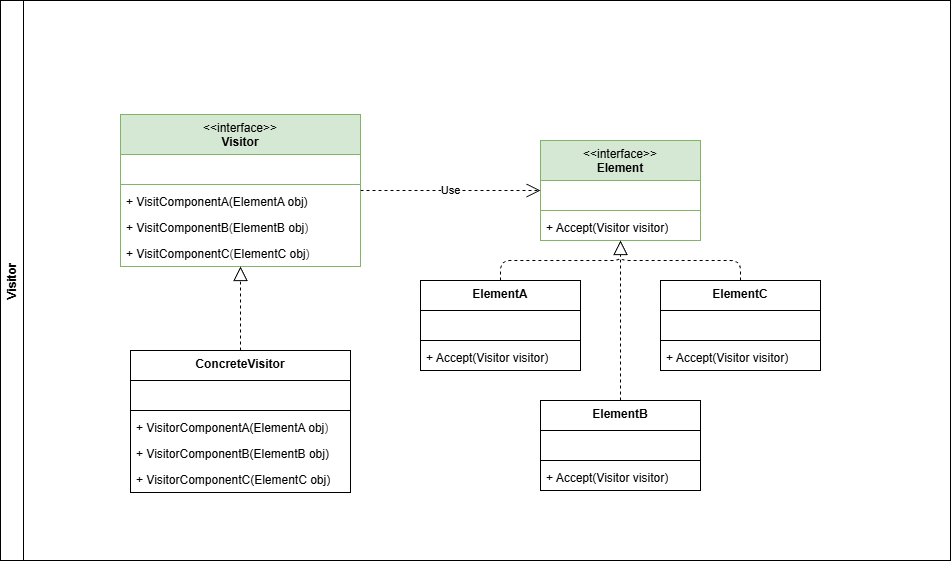

# Patrones de comportamiento

## Definición

Los patrones de comportamiento se enfocan en [la interacción y la comunicación entre los objetos](https://www.geeksforgeeks.org/system-design/behavioral-design-patterns/). Nos permiten definir cómo colaboran y cómo se distribuyen responsabilidades entre objetos.

Los patrones de comportamiento suelen facilitar el manejo de sistemas muy complejos o que tienen muchas reglas de negocio aplicadas.

## Clasificación

A continuación se desarrollan para cada uno de los patrones creacionales los siguientes items:

- Definición
- ¿Cuándo usar este patrón?
- ¿Cuales son sus componentes?
- Diagrama de clases
- Ejemplo

---

## Tabla de contenido

1. [Chain of Responsibility (CoR)](#chain-of-responsibility-cor)
2. [Command](#command)
3. [Iterator](#iterator)
4. [Mediator](#mediator)
5. [Memento](#memento)
6. [Observer](#observer)
7. [State](#state)
8. [Strategy](#strategy)
9. [Template Method](#template-method)
10. [Visitor](#visitor)

### Chain of Responsibility (CoR)

- **Definición**

El patrón **Chain of Responsibility** nos permite pasar peticiones entre diferentes handlers que se encuentran en una cadena de procesos.Cada handler está en la potestad de evaluar si puede procesar una petición o si la delega al siguiente handler.

- **¿Cuándo usar este patrón?**

✅ **Úsalo cuando:**

- Tienes un conjunto de objetos que pueden manejar una solicitud y deseas que la solicitud pase por la cadena hasta que un objeto la procese.
- Quieres evitar el acoplamiento entre el emisor de una solicitud y su receptor.
- Deseas agregar o cambiar dinámicamente los manejadores de una solicitud sin afectar a los demás manejadores.

❌ **NO lo uses cuando:**

- El orden de los manejadores en la cadena es crítico y no puede cambiarse dinámicamente.
- Necesitas que todos los manejadores procesen la solicitud en lugar de solo uno.
- La lógica de manejo es demasiado compleja y no puede dividirse fácilmente en responsabilidades separadas.

💡 **Señal de sobreingeniería:**

- La cadena de responsabilidad tiene demasiados manejadores, lo que dificulta el seguimiento del flujo de la solicitud.
- Los manejadores tienen demasiadas dependencias entre sí, lo que rompe el principio de responsabilidad única.

- **¿Cuales son sus componentes?**

  - **IHandler**: Interfaz común entre los handlers del proceso.
  - **Concrete Handlers**: Implementación concreta de los diferentes procesos.

- **Diagrama de clases**



- **Ejemplo**

Para ejemplificar el patrón **CoR** podemos tomar el escenario de la gestión de un ticket de soporte. La solicitud para el soporte tiene diferentes tipos de criticidad (BAJA, MEDIA, ALTA, CRITICA) cada una de estas es atendida por un equipo de soporte diferente.

El patrón **Chain of Responsibility** nos permite crear cada asignación de equipo en un handler diferente, cuando llega una petición, cada handler está en la capacidad de evaluar si puede gestionar la petición o si la escala al siguiente equipo.

```csharp

public enum ESupportClassification{
    LOW,
    MEDIUM,
    HIGH,
    CRITICAL
}

public record SupportRequest(
    Guid Id, 
    DateTime Date, 
    string Title, 
    string Description, 
    ESupportClassification Classification);

public interface ISupportTaskHandler{
    void SetNext(ISupportTaskHandler nextTask);
    Task Handle(SupportRequest request);
}

public sealed class SupportBasicHandler : ISupportTaskHandler{

    private ISupportTaskHandler _nextTask;

    public void SetNext(ISupportTaskHandler nextTask){
        _nextTask = nextTask;
    }

    public async Task Handle(SupportRequest request){

        if (request.Classification != ESupportClassification.LOW)
        {
            if (_nextTask != null)
            {
                await _nextTask.Handle(request);
            }
            return;
        }
        
        // Implementa lógica para soporte de criticidad baja
        Console.WriteLine("Solución criticidad baja");
    }

}

public sealed class SupportIntermediateHandler : ISupportTaskHandler{

    private ISupportTaskHandler _nextTask;

    public void SetNext(ISupportTaskHandler nextTask){
        _nextTask = nextTask;
    }

    public async Task Handle(SupportRequest request){

        if (request.Classification != ESupportClassification.MEDIUM)
        {
            if (_nextTask != null)
            {
                await _nextTask.Handle(request);
            }
            return;
        }
        
        // Implementa lógica para soporte de criticidad intermedia
        Console.WriteLine("Solución criticidad intermedia");
    }

}

public sealed class SupportHighHandler : ISupportTaskHandler{

    private ISupportTaskHandler _nextTask;

    public void SetNext(ISupportTaskHandler nextTask){
        _nextTask = nextTask;
    }

    public async Task Handle(SupportRequest request){

        if (request.Classification != ESupportClassification.HIGH)
        {
            if (_nextTask != null)
            {
                await _nextTask.Handle(request);
            }
            return;
        }
        
        // Implementa lógica para soporte de criticidad alta
        Console.WriteLine("Solución criticidad alta");
    }

}

public sealed class SupportCriticalHandler : ISupportTaskHandler{

    public void SetNext(ISupportTaskHandler nextTask){
        // No hay un paso siguiente porque este es el último handler en la cadena
    }

    public async Task Handle(SupportRequest request){

        if (request.Classification != ESupportClassification.CRITICAL)
        {
            Console.WriteLine("No existe una criticidad más alta");
            return;
        }
        
        // Implementa lógica para soporte de criticidad crítica
        Console.WriteLine("Solución criticidad crítica");
    }

}

```

[Volver a Indice](#tabla-de-contenido)

---

### Command

- **Definición**

El patrón **Command** permite encapsular peticiones dentro de un objeto, desacoplando el emisor del receptor. Este patrón permite que las peticiones sean pasadas como argumentos, encoladas, logueadas dentro de un historial de comandos o incluso tener operaciones reversibles.

- **¿Cuándo usar este patrón?**

✅ **Úsalo cuando:**

- Quieres encapsular una solicitud como un objeto, permitiendo parametrizar clientes con diferentes solicitudes.
- Necesitas realizar operaciones que puedan ser deshechas (deshacer/rehacer).
- Deseas mantener un historial de operaciones realizadas para poder auditarlas o repetirlas.
- Quieres desacoplar el objeto que invoca una operación del objeto que la ejecuta.

❌ **NO lo uses cuando:**

- La lógica de las operaciones es simple y no requiere ser encapsulada en objetos separados.
- No necesitas mantener un historial de operaciones ni realizar operaciones reversibles.
- El sistema no requiere flexibilidad para cambiar dinámicamente las solicitudes o comandos.

💡 **Señal de sobreingeniería:**

- Tienes demasiados comandos que son muy simples y no justifican el uso del patrón.
- La implementación del patrón introduce una complejidad innecesaria en un sistema que podría resolverse con métodos directos.
- Los comandos no son reutilizados ni se benefician de la flexibilidad que ofrece el patrón.

- **¿Cuales son sus componentes?**

  - **ICommand**: Interfaz común entre los comandos.
  - **Concrete Commands**: Implementación concreta de cada uno de los comandos.
  - **Invoker**: Se encarga de iniciar la ejecución de los comandos sin conocer los detalles.
  - **Receiver**: Ejecuta la operación definida por el comando.

- **Diagrama de clases**



- **Ejemplo**

Para dar un ejemplo sobre el patrón **Command** simularemos el siguiente escenario: Un sistema encargado de la logistica de una empresa, tiene dentro de sus operaciones despachar pedidos, generar pedidos, cancelar pedido. El patrón **Command** me permite separar cada uno de estos en comandos separados que voy a loguear en un historial y posteriormente a encolar a un broker de mensajes.

```csharp
public interface ICommand
{
    void Execute();
}

// Receiver
public class LogisticsSystem
{
    public void DispatchOrder()
    {
        Console.WriteLine("Order dispatched.");
    }

    public void GenerateOrder()
    {
        Console.WriteLine("Order generated.");
    }

    public void CancelOrder()
    {
        Console.WriteLine("Order canceled.");
    }
}

// Concrete Commands
public class DispatchOrderCommand : ICommand
{
    private readonly LogisticsSystem _logisticsSystem;

    public DispatchOrderCommand(LogisticsSystem logisticsSystem)
    {
        _logisticsSystem = logisticsSystem;
    }

    public void Execute()
    {
        _logisticsSystem.DispatchOrder();
    }
}

public class GenerateOrderCommand : ICommand
{
    private readonly LogisticsSystem _logisticsSystem;

    public GenerateOrderCommand(LogisticsSystem logisticsSystem)
    {
        _logisticsSystem = logisticsSystem;
    }

    public void Execute()
    {
        _logisticsSystem.GenerateOrder();
    }
}

public class CancelOrderCommand : ICommand
{
    private readonly LogisticsSystem _logisticsSystem;

    public CancelOrderCommand(LogisticsSystem logisticsSystem)
    {
        _logisticsSystem = logisticsSystem;
    }

    public void Execute()
    {
        _logisticsSystem.CancelOrder();
    }
}

// Invoker
public class CommandInvoker
{
    private readonly List<ICommand> _commandHistory = new();

    public void ExecuteCommand(ICommand command)
    {
        command.Execute();
        _commandHistory.Add(command);
    }

    public void ShowHistory()
    {
        Console.WriteLine("Command History:");
        foreach (var command in _commandHistory)
        {
            Console.WriteLine(command.GetType().Name);
        }
    }
}

// Example usage
class Program
{
    static void Main(string[] args)
    {
        var logisticsSystem = new LogisticsSystem();

        var dispatchCommand = new DispatchOrderCommand(logisticsSystem);
        var generateCommand = new GenerateOrderCommand(logisticsSystem);
        var cancelCommand = new CancelOrderCommand(logisticsSystem);

        var invoker = new CommandInvoker();

        invoker.ExecuteCommand(dispatchCommand);
        invoker.ExecuteCommand(generateCommand);
        invoker.ExecuteCommand(cancelCommand);

        invoker.ShowHistory();
    }
}
```

[Volver a Indice](#tabla-de-contenido)

---

### Iterator

- **Definición**

El patrón **Iterator** proporciona una forma uniforme de recorrer los elementos de una colección (como listas, pilas, colas o árboles) sin exponer su implementación interna. Este patrón utiliza un objeto iterador separado que encapsula la lógica de recorrido, permitiendo que la estructura interna de la colección pueda cambiar sin afectar la forma en que se accede a sus elementos.

- **¿Cuándo usar este patrón?**

✅ **Úsalo cuando:**

- Necesitas recorrer una colección de elementos sin exponer su estructura interna.
- Quieres proporcionar múltiples formas de recorrer una colección (por ejemplo, hacia adelante, hacia atrás, por niveles, etc.).
- Deseas unificar la forma de iterar sobre diferentes tipos de colecciones.

❌ **NO lo uses cuando:**

- La colección es simple y no requiere un objeto iterador separado para recorrerla.
- No necesitas diferentes formas de recorrer la colección.
- La colección es inmutable y no se espera que cambie su estructura interna.

💡 **Señal de sobreingeniería:**

- Creas iteradores para colecciones que no necesitan un recorrido complejo o personalizado.
- La implementación del iterador es más compleja que la propia colección.
- Existen múltiples iteradores que no aportan un valor significativo al diseño del sistema.

- **¿Cuales son sus componentes?**

  - **Iterable Collection**: Define la interfaz para crear iteradores de un objeto.
  - **Concrete Iterable Collection**: Implementación concreta de cada uno de los iteradores.
  - **Iterator**: Define la interfaz para acceder y recorrer los elementos de la colección.
  - **Concrete Iterator**: Implementación concreta para mantener la posicion actual y define las operaciones posibles del iterador.

- **Diagrama de clases**



- **Ejemplo**

Para ejemplificar el patrón **Iterator** imaginemos que dentro del sistema tenemos una coleccion de productos, los cuales tienen diferentes formas de recorrerse dependiendo de la funcionalidad seleccionada. Listar productos nuevos permite recorrer los productos en orden descendente a su fecha de creacion. Listar productos con poco stock permite recorrer los productos que tienen menor stock y puede que en el futuro se implementen más tipos de llamados.

```csharp
// Producto
public class Producto
{
    public string Nombre { get; set; }
    public DateTime FechaCreacion { get; set; }
    public int Stock { get; set; }

    public Producto(string nombre, DateTime fechaCreacion, int stock)
    {
        Nombre = nombre;
        FechaCreacion = fechaCreacion;
        Stock = stock;
    }
}

// Interfaz Iterator
public interface IIterator<T>
{
    bool HasNext();
    T Next();
}

// Interfaz Iterable Collection
public interface IProductoCollection
{
    IIterator<Producto> CreateFechaCreacionIterator();
    IIterator<Producto> CreateStockIterator();
}

// Implementación concreta de la colección
public class ProductoCollection : IProductoCollection
{
    private List<Producto> _productos = new();

    public void AddProducto(Producto producto)
    {
        _productos.Add(producto);
    }

    public IIterator<Producto> CreateFechaCreacionIterator()
    {
        return new FechaCreacionIterator(_productos);
    }

    public IIterator<Producto> CreateStockIterator()
    {
        return new StockIterator(_productos);
    }
}

// Implementación concreta del iterador por fecha de creación
public class FechaCreacionIterator : IIterator<Producto>
{
    private readonly List<Producto> _productos;
    private int _position;

    public FechaCreacionIterator(List<Producto> productos)
    {
        _productos = productos.OrderByDescending(p => p.FechaCreacion).ToList();
        _position = 0;
    }

    public bool HasNext()
    {
        return _position < _productos.Count;
    }

    public Producto Next()
    {
        return _productos[_position++];
    }
}

// Implementación concreta del iterador por stock
public class StockIterator : IIterator<Producto>
{
    private readonly List<Producto> _productos;
    private int _position;

    public StockIterator(List<Producto> productos)
    {
        _productos = productos.OrderBy(p => p.Stock).ToList();
        _position = 0;
    }

    public bool HasNext()
    {
        return _position < _productos.Count;
    }

    public Producto Next()
    {
        return _productos[_position++];
    }
}

// Ejemplo de uso
class Program
{
    static void Main(string[] args)
    {
        var productos = new ProductoCollection();
        productos.AddProducto(new Producto("Producto A", new DateTime(2026, 1, 1), 50));
        productos.AddProducto(new Producto("Producto B", new DateTime(2026, 2, 1), 20));
        productos.AddProducto(new Producto("Producto C", new DateTime(2025, 12, 1), 100));

        Console.WriteLine("Recorrido por fecha de creación (descendente):");
        var fechaIterator = productos.CreateFechaCreacionIterator();
        while (fechaIterator.HasNext())
        {
            var producto = fechaIterator.Next();
            Console.WriteLine($"{producto.Nombre} - {producto.FechaCreacion}");
        }

        Console.WriteLine("\nRecorrido por stock (ascendente):");
        var stockIterator = productos.CreateStockIterator();
        while (stockIterator.HasNext())
        {
            var producto = stockIterator.Next();
            Console.WriteLine($"{producto.Nombre} - Stock: {producto.Stock}");
        }
    }
}
```

[Volver a Indice](#tabla-de-contenido)

---

## Mediator

- **Definición**

El patrón **Mediator** nos permite simplificar la comunicación entre los objetos quitando el caos de dependencias y reemplazándolo por un objeto mediador. Todos los objetos se deben comunicar a través del mediador.

- **¿Cuándo usar este patrón?**

✅ **Úsalo cuando:**

- Tienes múltiples objetos que necesitan comunicarse entre sí, pero deseas evitar dependencias directas entre ellos.
- Quieres centralizar la lógica de comunicación o control entre varios objetos en un único lugar.
- Deseas facilitar el mantenimiento y la escalabilidad del sistema al reducir el acoplamiento entre los objetos.

❌ **NO lo uses cuando:**

- Los objetos pueden comunicarse directamente sin generar un acoplamiento excesivo.
- El mediador se convierte en un punto único de fallo o se vuelve demasiado complejo debido a la cantidad de lógica que maneja.
- El sistema es simple y no requiere una estructura centralizada para la comunicación.

💡 **Señal de sobreingeniería:**

- El mediador se convierte en una clase monolítica que gestiona demasiada lógica, dificultando su mantenimiento.
- Los objetos dependen excesivamente del mediador, perdiendo su independencia y flexibilidad.
- Se utiliza el patrón en un sistema donde las dependencias directas entre objetos son mínimas y no generan problemas.

- **¿Cuales son sus componentes?**

  - **Mediator**: Define el contrato de comunicación.
  - **Concrete Mediator**: Implementación concreta del mediador, facilitando la comunicacion entre objetos Colleague.
  - **Colleague**: Interfaz que define las clases que se van a comunicar.
  - **Concrete Colleague**: Implementación concreta de la clase que se va a comunicar. Este objeto delega la comunicación al mediador.

- **Diagrama de clases**



- **Ejemplo**

El patrón **Mediator** se puede ejemplificar usando el siguiente escenario: Una compañía tiene dentro de su operación varías areas encargadas de llevar a cabo un pedido del cliente. El área comercial se encarga de tomar el pedido del cliente, el área de almacenamiento organiza los productos y embala el pedido, el area de transporte se encarga de llevarlo al cliente. Para que esta operación salga bien, cada área debe comunicar a los demás el estado de su proceso.

Usando el patrón **Mediator** se sustituyen las dependencias entre áreas y se asigna a una clase mediadora que ayuda a validar los estados, activar o desactivas procesos.

```csharp
// Interfaz del Mediador
public interface IMediator
{
    void Notify(object sender, string eventMessage);
}

// Clase Mediador Concreto
public class OrderMediator : IMediator
{
    private Commercial _commercial;
    private Storage _storage;
    private Transport _transport;

    public void SetCommercial(Commercial commercial)
    {
        _commercial = commercial;
        _commercial.SetMediator(this);
    }

    public void SetStorage(Storage storage)
    {
        _storage = storage;
        _storage.SetMediator(this);
    }

    public void SetTransport(Transport transport)
    {
        _transport = transport;
        _transport.SetMediator(this);
    }

    public void Notify(object sender, string eventMessage)
    {
        if (eventMessage == "OrderReceived")
        {
            Console.WriteLine("Mediator: Comercial ha recibido un pedido. Notificando a Almacenamiento...");
            _storage.PrepareOrder();
        }
        else if (eventMessage == "OrderPrepared")
        {
            Console.WriteLine("Mediator: Almacenamiento ha preparado el pedido. Notificando a Transporte...");
            _transport.DeliverOrder();
        }
        else if (eventMessage == "OrderDelivered")
        {
            Console.WriteLine("Mediator: Transporte ha entregado el pedido. Operación completada.");
        }
    }
}

// Interfaz Colleague
public abstract class Department
{
    protected IMediator _mediator;

    public void SetMediator(IMediator mediator)
    {
        _mediator = mediator;
    }
}

// Clase Comercial (Concrete Colleague)
public class Commercial : Department
{
    public void ReceiveOrder()
    {
        Console.WriteLine("Comercial: Pedido recibido del cliente.");
        _mediator.Notify(this, "OrderReceived");
    }
}

// Clase Almacenamiento (Concrete Colleague)
public class Storage : Department
{
    public void PrepareOrder()
    {
        Console.WriteLine("Almacenamiento: Preparando y embalando el pedido.");
        _mediator.Notify(this, "OrderPrepared");
    }
}

// Clase Transporte (Concrete Colleague)
public class Transport : Department
{
    public void DeliverOrder()
    {
        Console.WriteLine("Transporte: Entregando el pedido al cliente.");
        _mediator.Notify(this, "OrderDelivered");
    }
}

// Ejemplo de uso
class Program
{
    static void Main(string[] args)
    {
        // Crear el mediador
        var mediator = new OrderMediator();

        // Crear los departamentos
        var commercial = new Commercial();
        var storage = new Storage();
        var transport = new Transport();

        // Configurar el mediador con los departamentos
        mediator.SetCommercial(commercial);
        mediator.SetStorage(storage);
        mediator.SetTransport(transport);

        // Iniciar el proceso desde el área comercial
        commercial.ReceiveOrder();
    }
}
```

[Volver a Indice](#tabla-de-contenido)

---

## Memento

- **Definición**

El patrón **Memento** permite realizar una captura del estado actual de un objeto sin la necesidad de exponer sus detalles internos. Esta captura es guardada con el objetivo de poder restaurar versiones anteriores del objeto.

- **¿Cuándo usar este patrón?**

✅ **Úsalo cuando:**

- Necesitas guardar el estado de un objeto para restaurarlo más tarde.
- Quieres implementar una funcionalidad de deshacer/rehacer en tu aplicación.
- Deseas evitar exponer detalles internos del estado de un objeto.

❌ **NO lo uses cuando:**

- El almacenamiento del estado completo del objeto es demasiado costoso en términos de memoria.
- No necesitas restaurar estados previos del objeto.
- El estado del objeto puede ser reconstruido fácilmente sin necesidad de un memento.

💡 **Señal de sobreingeniería:**

- Estás almacenando demasiados mementos, lo que consume una cantidad excesiva de memoria.
- El sistema no requiere realmente la funcionalidad de deshacer/rehacer, pero se implementa de todos modos.
- Los mementos contienen demasiada información, lo que complica su gestión y mantenimiento.

- **¿Cuales son sus componentes?**

  - **Originator**: Este es el encargado de crear y mantener el estado de un objeto. Se comunica directamente con el memento para crear una captura del estado actual.
  - **Memento**: Almacena el estado actual del Originator en un punto determinado de tiempo. Solo provee una forma de retornar el estado sin realizar cambios directos.
  - **Caretaker**: Es el responsable de almacenar y hacer un registro de los objetos Mementos. No conoce los detalles del estado, su función es almacenar o pedir mementos desde el Originator para restaurar versiones o deshacer cambios.

- **Diagrama de clases**



- **Ejemplo**

Uno de los ejemplos más usados para representar el beneficio del patrón **Memento** suele ser un editor de texto o un video juego ya que estos tienen la posibilidad de restaurar y deshacer comportamientos. Para este caso en particular utilizaremos el video juego.

Supongamos que tenemos un personaje que a medida que avanza el video juego va adquiriendo objetos en el inventario, dentro del juego hay checkpoints ya que si algo le llega a pasar al personaje, es posible reaparecer con el estado del último checkpoint.

```csharp
public class GameCharacter
{
    public string Name { get; private set; }
    public int Health { get; private set; }
    public List<string> Inventory { get; private set; }

    public GameCharacter(string name)
    {
        Name = name;
        Health = 100;
        Inventory = new List<string>();
    }

    public void AddToInventory(string item)
    {
        Inventory.Add(item);
    }

    public void ReduceHealth(int damage)
    {
        Health -= damage;
    }

    public CharacterMemento SaveState()
    {
        return new CharacterMemento(Name, Health, new List<string>(Inventory));
    }

    public void RestoreState(CharacterMemento memento)
    {
        Name = memento.Name;
        Health = memento.Health;
        Inventory = new List<string>(memento.Inventory);
    }

    public override string ToString()
    {
        return $"Name: {Name}, Health: {Health}, Inventory: [{string.Join(", ", Inventory)}]";
    }
}

public class CharacterMemento
{
    public string Name { get; }
    public int Health { get; }
    public List<string> Inventory { get; }

    public CharacterMemento(string name, int health, List<string> inventory)
    {
        Name = name;
        Health = health;
        Inventory = inventory;
    }
}

public class CheckpointManager
{
    private readonly Stack<CharacterMemento> _checkpoints = new();

    public void SaveCheckpoint(CharacterMemento memento)
    {
        _checkpoints.Push(memento);
    }

    public CharacterMemento RestoreCheckpoint()
    {
        return _checkpoints.Count > 0 ? _checkpoints.Pop() : null;
    }
}

// Ejemplo de uso
class Program
{
    static void Main(string[] args)
    {
        var character = new GameCharacter("Hero");
        var checkpointManager = new CheckpointManager();

        character.AddToInventory("Sword");
        checkpointManager.SaveCheckpoint(character.SaveState());

        character.AddToInventory("Shield");
        character.ReduceHealth(50);
        checkpointManager.SaveCheckpoint(character.SaveState());

        character.AddToInventory("Potion");
        character.ReduceHealth(30);

        Console.WriteLine("Estado actual del personaje:");
        Console.WriteLine(character);

        Console.WriteLine("\nRestaurando al último checkpoint...");
        character.RestoreState(checkpointManager.RestoreCheckpoint());
        Console.WriteLine(character);

        Console.WriteLine("\nRestaurando al checkpoint inicial...");
        character.RestoreState(checkpointManager.RestoreCheckpoint());
        Console.WriteLine(character);
    }
}
```

[Volver a Indice](#tabla-de-contenido)

---

## Observer

- **Definición**

El patrón de comportamiento **Observer** permite crear una relación de uno a muchos, definiendo un mecanismo de subscripción para notificar a muchos objetos cuando ocurra un evento en el objeto observado. Una vez el estado actual del objeto observado cambie, todos los observadores son notificados para asegurar una comunicación sincronizada.

- **¿Cuándo usar este patrón?**

✅ **Úsalo cuando:**

- Necesitas notificar a múltiples objetos sobre cambios en el estado de otro objeto.
- Quieres asegurar que los objetos dependientes estén sincronizados automáticamente con el estado del objeto observado.
- Deseas implementar un sistema de eventos donde los suscriptores puedan registrarse y recibir notificaciones de cambios.

❌ **NO lo uses cuando:**

- Hay una relación de dependencia compleja entre los observadores y el sujeto, lo que puede dificultar el mantenimiento.
- El número de observadores es muy grande y puede afectar el rendimiento del sistema debido a la cantidad de notificaciones.
- Los observadores necesitan saber demasiado sobre el estado interno del sujeto para reaccionar adecuadamente.

💡 **Señal de sobreingeniería:**

- Tienes pocos observadores o ninguno, lo que hace innecesario el uso del patrón.
- La implementación del patrón introduce una complejidad innecesaria en un sistema simple.
- Los observadores no reaccionan de manera significativa a los cambios del sujeto, lo que indica que el patrón no está aportando valor.

- **¿Cuales son sus componentes?**

  - **Subject**: Interfaz que promueve los métodos para agregar, remover y notificar observadores. Contiene una lista de observadores.
  - **Observer**: Interfaz común que deben implementar todos los observadores con un método Update() que permite actualizar todos los observadores de forma sincronizada.
  - **Concrete Subjects**: Implementación concreta de la interfaz subject, cuando un estado cambia, se encarga de notificar a todos los observadores.
  - **Concrete Observers**: Implementación concreta de la interfaz observer, se encarga de reaccionar al evento publicado por el sujeto.

- **Diagrama de clases**



- **Ejemplo**

Para ejemplificar el patrón **Observer** supongamos que tenemos un sistema educativo, donde cada docente escribe un newsletter que le permite mostrar algún tema de interes. Los usuarios interesados en aprender sobre tecnología se pueden subscribir para que semanalmente les llegue al correo la notificación informando la publicación.

```csharp

//Interfaz Subject
public interface IPublisher{
    void AddSubscriber(ISubscriber subscriber);
    void RemoveSubscriber(ISubscriber subscriber);
    Task Notify();
}

//Interfaz Observer
public interface ISubscriber{
    string Email {get;}
    Task Update();
}

//Concrete Subject
public sealed class Writer() : IPublisher{
    private List<ISubscriber> readers = new();

    public void AddSubscriber(ISubscriber subscriber){
        if(subscriber is null) return;
        readers.Add(subscriber);
    }

    public void RemoveSubscriber(ISubscriber subscriber){
        if(subscriber is null) return;
        var subscriberFound = readers.FirstOrDefault(s => s.Email == subscriber.Email);
        if(subscriberFound is null) return;
        readers.Remove(subscriberFound);
    }

    public async Task Notify(){
        foreach (ISubscriber reader in readers){
            await reader.Update();
        }
    }
}

//Concrete Observers
public sealed class Reader : ISubscriber
{
    public string Email { get; }

    public Reader(string email)
    {
        Email = email;
    }

    public async Task Update()
    {
        // Simular envío de correo electrónico
        await Task.Delay(500); // Simula un retraso en el envío del correo
        Console.WriteLine($"Notificación enviada a: {Email}");
    }
}

class Program
{
    static async Task Main(string[] args)
    {
        // Crear el sujeto (Writer)
        var writer = new Writer();

        // Crear observadores (Readers)
        var reader1 = new Reader("reader1@example.com");
        var reader2 = new Reader("reader2@example.com");

        // Suscribir observadores al sujeto
        writer.AddSubscriber(reader1);
        writer.AddSubscriber(reader2);

        // Notificar a los observadores
        Console.WriteLine("Notificando a los suscriptores...");
        await writer.Notify();

        // Eliminar un suscriptor
        writer.RemoveSubscriber(reader1);

        // Notificar nuevamente
        Console.WriteLine("Notificando a los suscriptores después de eliminar uno...");
        await writer.Notify();
    }
}

```

[Volver a Indice](#tabla-de-contenido)

---

## State

- **Definición**

Este patrón permite que un objeto altere su comportamiento cuando su estado interno cambia. Este encapsula el comportamiento especifico de un estado dentro de clases separadas, permitiendo que el objeto maneje sus diferentes estados de forma limpia, evitando condicionales complejos.

Esta patrón esta muy relacionado con una maquina de estados finitos [ver más...](https://refactoring.guru/design-patterns/state)

- **¿Cuándo usar este patrón?**

✅ **Úsalo cuando:**

- Un objeto tiene múltiples estados bien definidos y su comportamiento cambia radicalmente según el estado actual.
- Tienes grandes estructuras condicionales (if/switch statements) basadas en el estado del objeto.
- Los cambios de estado son frecuentes y predecibles, y necesitas una forma limpia de gestionarlos.
- Quieres evitar afectar a otras partes del sistema cuando cambias la lógica específica de un estado.
- Necesitas implementar una máquina de estados finita con transiciones claras entre estados.
- Diferentes estados requieren algoritmos completamente diferentes.

❌ **NO lo uses cuando:**

- El objeto tiene solo uno o dos estados simples sin lógica compleja asociada.
- El comportamiento del objeto no cambia significativamente entre estados.
- Tienes un número muy grande de estados (más de 10-15), lo que haría el diseño difícil de mantener.
- Las transiciones entre estados son triviales o pueden resolverse con simples banderas booleanas.
- Los cambios de estado son raros o no ocurren en tiempo de ejecución.

💡 **Señal de sobreingeniería:**

- Creas múltiples clases de estado para comportamientos que son casi idénticos o muy simples.
- El patrón introduce más complejidad en el código que la que tenías con simples condicionales.
- Tienes clases de estado que casi nunca se usan o que contienen muy poca lógica.
- La mayoría de los métodos de estado hacen poco más que llamar a métodos del contexto.
- Las transiciones de estado son tan complejas que resultan difíciles de entender y mantener.

- **¿Cuales son sus componentes?**

  - **Context**: Esta clase mantiene una referencia con el estado actual, es la interfaz con la que se comunica el cliente.
  - **State**: Interfaz común que tiene todos los métodos ejecutables de un estado.
  - **Concrete States**: Implementación concreta de cada estado, encapsulando el comportamiento del estado especifico.

- **Diagrama de clases**



- **Ejemplo**

Supongamos que tenemos un sistema de soporte al cliente, donde los clientes envían tickets, estos tienen diferentes estados: Sin asignar, En proceso, Resuelto, Cerrado. Dependiendo del estado, el ticket va a tener un comportamiento diferente, por ejemplo, si el ticket esta sin asignar, se le puede asignar un agente. Si el ticket esta en proceso, se le puede agregar una nota o marcarlo como resuelto. Si el ticket esta resuelto, se le puede marcar como cerrado o reabrirlo.

```csharp
public enum EState
{
    UNASSIGNED,
    IN_PROGRESS,
    RESOLVED,
    CLOSED
}

public record RequestTicket(
    string Title, 
    string Description,
    EState State
);

public interface ITicketState
{
    Task Handle(RequestTicket ticket);
}

public sealed class UnassignedState : ITicketState
{
    public async Task Handle(RequestTicket ticket)
    {
        //Añade lógica para asignar un agente al ticket
        Console.WriteLine("Ticket sin asignar, asignando agente...");
    }
}

public sealed class InProgressState : ITicketState
{
    public async Task Handle(RequestTicket ticket)
    {
        //Añade lógica para agregar una nota o marcar como resuelto
        Console.WriteLine("Ticket en proceso, agregando nota...");
        bool isResolved = true; // Simula la resolución del ticket
        if (isResolved)
        {
            ticket = ticket with { State = EState.RESOLVED };
            Console.WriteLine("Ticket marcado como resuelto.");
        }
    }
}

public sealed class ResolvedState : ITicketState
{
    public async Task Handle(RequestTicket ticket)
    {
        //Añade lógica para marcar como cerrado o reabrir el ticket
        Console.WriteLine("Ticket resuelto, marcando como cerrado...");
        bool isClosed = true; // Simula el cierre del ticket
        if (isClosed)
        {
            ticket = ticket with { State = EState.CLOSED };
            Console.WriteLine("Ticket marcado como cerrado.");
        }
    }
}

public sealed class ClosedState : ITicketState
{
    public async Task Handle(RequestTicket ticket)
    {
        //Añade lógica para reabrir el ticket
        Console.WriteLine("Ticket cerrado, reabriendo...");
        bool isReopened = true; // Simula la reapertura del ticket
        if (isReopened)
        {
            ticket = ticket with { State = EState.IN_PROGRESS };
            Console.WriteLine("Ticket reabierto y marcado como en proceso.");
        }
    }
}

public class TicketContext(ITicketState state)
{
    private ITicketState _state = state;

    public void SetState(ITicketState state)
    {
        _state = state;
    }

    public async Task Handle(RequestTicket ticket)
    {
        await _state.Handle(ticket);
    }
}

// Ejemplo de uso
class Program
{
    static async Task Main(string[] args)
    {
        var ticket = new RequestTicket("Problema con la aplicación", "La aplicación se cierra inesperadamente.", EState.UNASSIGNED);
        var context = new TicketContext(new UnassignedState());

        Console.WriteLine($"Estado inicial del ticket: {ticket.State}");
        await context.Handle(ticket);

        context.SetState(new InProgressState());
        await context.Handle(ticket);

        context.SetState(new ResolvedState());
        await context.Handle(ticket);

        context.SetState(new ClosedState());
        await context.Handle(ticket);
    }
}

```

[Volver a Indice](#tabla-de-contenido)

---

## Strategy

- **Definición**

Este patrón define un grupo de algoritmos relacionados, encapsula cada uno de ellos y los hace intercambiables. El patrón Strategy permite que el algoritmo varíe independientemente de los clientes que lo utilizan, permitiendo que el cliente pueda elegir el algoritmo a utilizar en tiempo de ejecución.

- **¿Cuándo usar este patrón?**

✅ **Úsalo cuando:**

- Tienes varias formas de realizar una operación y quieres que el algoritmo pueda cambiarse en tiempo de ejecución.
- Quieres evitar estructuras condicionales complejas (if/switch) para seleccionar el algoritmo a utilizar.
- Deseas que los algoritmos sean independientes y fácilmente intercambiables o extensibles.
- Necesitas que los algoritmos puedan ser reutilizados en diferentes contextos.

❌ **NO lo uses cuando:**

- Solo tienes un algoritmo o la variación entre algoritmos es mínima.
- El algoritmo rara vez cambia o no se requiere flexibilidad en la selección del mismo.
- El costo de crear múltiples clases para cada estrategia supera los beneficios de flexibilidad.

💡 **Señal de sobreingeniería:**

- Creas estrategias para algoritmos triviales o que no justifican la abstracción.
- El número de estrategias crece innecesariamente y la mayoría no se usan.
- El patrón introduce más complejidad que la que resuelve, especialmente si los algoritmos no cambian.

- **¿Cuales son sus componentes?**

  - **Context**: Mantiene una referencia a una instancia de una estrategia concreta y se comunica con ella para ejecutar el algoritmo.
  - **Strategy**: Interfaz común que define el contrato para todas las estrategias concretas.
  - **Concrete Strategies**: Implementación concreta de cada estrategia, encapsulando un algoritmo específico.

- **Diagrama de clases**



- **Ejemplo**

Supongamos que tenemos un sistema de procesamiento de pagos, donde los clientes pueden elegir entre diferentes métodos de pago como tarjeta de crédito, PayPal o transferencia bancaria. Cada método de pago tiene su propia lógica de procesamiento, pero el cliente puede cambiar el método de pago en tiempo de ejecución.

```csharp
public interface IPaymentStrategy
{
    void Pay(decimal amount);
}

public class CreditCardPayment : IPaymentStrategy
{
    public void Pay(decimal amount)
    {
        Console.WriteLine($"Procesando pago de {amount} con tarjeta de crédito.");
    }
}

public class PayPalPayment : IPaymentStrategy
{
    public void Pay(decimal amount)
    {
        Console.WriteLine($"Procesando pago de {amount} con PayPal.");
    }
}

public class BankTransferPayment : IPaymentStrategy
{
    public void Pay(decimal amount)
    {
        Console.WriteLine($"Procesando pago de {amount} con transferencia bancaria.");
    }
}

public class PaymentContext
{
    private IPaymentStrategy _paymentStrategy;

    public void SetPaymentStrategy(IPaymentStrategy paymentStrategy)
    {
        _paymentStrategy = paymentStrategy;
    }

    public void Pay(decimal amount)
    {
        if (_paymentStrategy == null)
        {
            Console.WriteLine("No se ha seleccionado un método de pago.");
            return;
        }
        _paymentStrategy.Pay(amount);
    }
}

// Ejemplo de uso
class Program
{
    static void Main(string[] args)
    {
        var paymentContext = new PaymentContext();

        // El cliente elige pagar con tarjeta de crédito
        paymentContext.SetPaymentStrategy(new CreditCardPayment());
        paymentContext.Pay(100);

        // El cliente decide cambiar a PayPal
        paymentContext.SetPaymentStrategy(new PayPalPayment());
        paymentContext.Pay(200);

        // El cliente decide cambiar a transferencia bancaria
        paymentContext.SetPaymentStrategy(new BankTransferPayment());
        paymentContext.Pay(300);
    }
}

```

[Volver a Indice](#tabla-de-contenido)

---

## Template Method

- **Definición**

El patrón **Template Method** define el esqueleto de un algoritmo en una operación, dejando algunos pasos a ser implementados por las subclases. Este patrón permite que las subclases redefinan ciertos pasos de un algoritmo sin cambiar su estructura general.

- **¿Cuándo usar este patrón?**

✅ **Úsalo cuando:**

- Tienes un algoritmo que tiene una estructura general fija, pero algunos pasos pueden variar entre implementaciones.
- Quieres evitar la duplicación de código en algoritmos similares que solo difieren en algunos pasos.
- Deseas permitir que las subclases redefinan ciertos pasos de un algoritmo sin cambiar la estructura general.
- Necesitas controlar el flujo de un algoritmo y garantizar que ciertos pasos siempre se ejecuten en un orden específico.

❌ **NO lo uses cuando:**

- El algoritmo no tiene pasos fijos o la variación entre implementaciones es mínima.
- Los pasos variables no justifican la creación de una jerarquía de clases.
- Puedes resolver el problema de manera más simple usando composición o delegación en lugar de herencia.
- El algoritmo es tan simple que no requiere una estructura formal.

💡 **Señal de sobreingeniería:**

- Creas clases abstractas y métodos plantilla para algoritmos triviales o con poca variación.
- La jerarquía de clases crece innecesariamente solo para soportar pequeñas diferencias en el comportamiento.
- Los métodos plantilla se usan en exceso y la mayoría de las subclases solo implementan detalles mínimos.
- El patrón introduce más complejidad que la que resuelve, especialmente si los pasos variables podrían implementarse con funciones simples o lambdas.

- **¿Cuales son sus componentes?**

  - **Abstract Class**: Define el esqueleto del algoritmo, incluyendo los pasos que deben ser implementados por las subclases.
  - **Concrete Class**: Implementa los pasos específicos del algoritmo definidos en la clase abstracta.

- **Diagrama de clases**



- **Ejemplo**

Supongamos que tenemos un sistema para la generación de reportes, donde cada tipo de reporte tiene una estructura general similar pero con pasos específicos que varían según el tipo de reporte. Por ejemplo, un reporte de ventas y un reporte de inventario pueden compartir la misma estructura general, pero los datos que se recopilan y cómo se formatean pueden ser diferentes.

```csharp
public abstract class ReportGenerator
{
    public void GenerateReport()
    {
        CollectData();
        AnalyzeData();
        FormatReport();
        PrintReport();
    }

    protected abstract void CollectData();
    protected abstract void AnalyzeData();
    protected abstract void FormatReport();

    private void PrintReport()
    {
        Console.WriteLine("Imprimiendo el reporte...");
    }
}

public class SalesReportGenerator : ReportGenerator
{
    protected override void CollectData()
    {
        Console.WriteLine("Recopilando datos de ventas...");
    }

    protected override void AnalyzeData()
    {
        Console.WriteLine("Analizando datos de ventas...");
    }

    protected override void FormatReport()
    {
        Console.WriteLine("Formateando reporte de ventas...");
    }
}

public class InventoryReportGenerator : ReportGenerator
{
    protected override void CollectData()
    {
        Console.WriteLine("Recopilando datos de inventario...");
    }

    protected override void AnalyzeData()
    {
        Console.WriteLine("Analizando datos de inventario...");
    }

    protected override void FormatReport()
    {
        Console.WriteLine("Formateando reporte de inventario...");
    }
}

// Ejemplo de uso
class Program
{
    static void Main(string[] args)
    {
        ReportGenerator salesReport = new SalesReportGenerator();
        salesReport.GenerateReport();

        Console.WriteLine();

        ReportGenerator inventoryReport = new InventoryReportGenerator();
        inventoryReport.GenerateReport();
    }
}
```

[Volver a Indice](#tabla-de-contenido)

---

## Visitor

- **Definición**

El patrón **Visitor** permite agregar nuevas operaciones a una clase preexistente sin modificar su estructura. Este patrón se basa en la idea de separar un algoritmo de la estructura de objetos sobre la que opera, permitiendo que el algoritmo pueda variar independientemente de los objetos.

- **¿Cuándo usar este patrón?**

✅ **Úsalo cuando:**

- Tienes una estructura de objetos compleja y necesitas agregar nuevas operaciones sin modificar las clases existentes.
- Quieres separar algoritmos de la estructura de datos sobre la que operan.
- Necesitas realizar operaciones que involucren muchas clases de una jerarquía sin acoplarlas a las operaciones.
- Requieres agregar funcionalidades a una familia de objetos sin alterar su código fuente.

❌ **NO lo uses cuando:**

- La jerarquía de clases es estable y rara vez cambian las operaciones.
- Las operaciones a agregar son pocas y no justifican la complejidad del patrón.
- Los elementos a visitar cambian frecuentemente, ya que cada cambio requiere modificar todos los visitantes.
- El acceso a los atributos internos de los elementos puede romper el encapsulamiento.

💡 **Señal de sobreingeniería:**

- Implementas Visitor para jerarquías simples o con pocas operaciones, añadiendo complejidad innecesaria.
- El número de visitantes crece rápidamente y la mayoría solo implementa lógica trivial.
- Los visitantes requieren acceso a demasiados detalles internos de los elementos, rompiendo el encapsulamiento.
- El patrón introduce más clases y métodos de los que realmente se necesitan para el problema actual.

- **¿Cuales son sus componentes?**
  
  - **Visitor**: Define una interfaz para visitar cada tipo de elemento en la estructura de objetos. Cada método de visita corresponde a un tipo específico de elemento.
  - **Concrete Visitor**: Implementa la interfaz Visitor, definiendo la operación específica para cada tipo de elemento.
  - **Element**: Define una interfaz que acepta un visitante como argumento.
  - **Concrete Element**: Implementa la interfaz Element, permitiendo que el visitante acceda a su información.

- **Diagrama de clases**



- **Ejemplo**

Supongamos que tenemos una estructura de objetos que representa diferentes tipos de documentos, como un documento de texto, una hoja de cálculo y una presentación. Queremos agregar una operación para exportar estos documentos a diferentes formatos (PDF, Word, Excel) sin modificar las clases de los documentos.

```csharp
// Interfaz Visitor
public interface IDocumentVisitor
{
    void Visit(TextDocument textDocument);
    void Visit(SpreadsheetDocument spreadsheetDocument);
    void Visit(PresentationDocument presentationDocument);
}

// Concrete Visitor
public class ExportVisitor : IDocumentVisitor
{
    public void Visit(TextDocument textDocument)
    {
        Console.WriteLine("Exportando documento de texto a PDF...");
    }

    public void Visit(SpreadsheetDocument spreadsheetDocument)
    {
        Console.WriteLine("Exportando hoja de cálculo a Excel...");
    }

    public void Visit(PresentationDocument presentationDocument)
    {
        Console.WriteLine("Exportando presentación a PowerPoint...");
    }
}

// Interfaz Element
public interface IDocument
{
    void Accept(IDocumentVisitor visitor);
}

// Concrete Elements
public class TextDocument : IDocument
{
    public void Accept(IDocumentVisitor visitor)
    {
        visitor.Visit(this);
    }
}

public class SpreadsheetDocument : IDocument
{
    public void Accept(IDocumentVisitor visitor)
    {
        visitor.Visit(this);
    }
}

public class PresentationDocument : IDocument
{
    public void Accept(IDocumentVisitor visitor)
    {
        visitor.Visit(this);
    }
}


// Ejemplo de uso
class Program
{
    static void Main(string[] args)
    {
        var documents = new List<IDocument>
        {
            new TextDocument(),
            new SpreadsheetDocument(),
            new PresentationDocument()
        };

        var exportVisitor = new ExportVisitor();

        foreach (var document in documents)
        {
            document.Accept(exportVisitor);
        }
    }
}
```

[Volver a Indice](#tabla-de-contenido)
