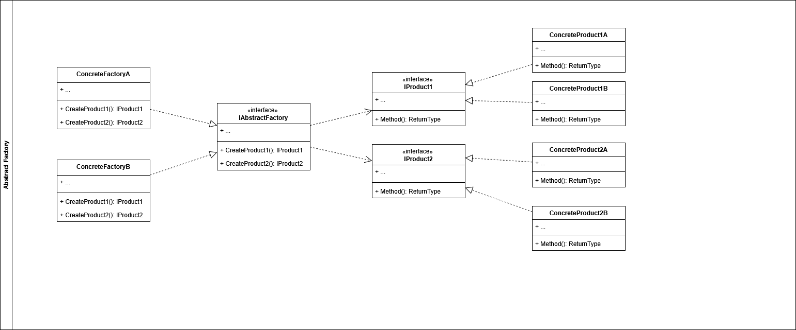
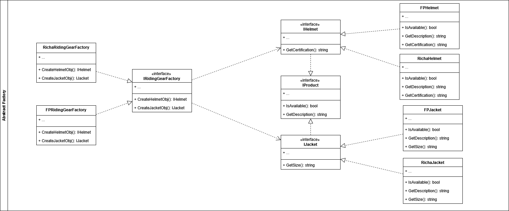

# Abstract Factory

El patrón de diseño *Abstract Factory* permite la creación de familias de objetos usando una interfaz sin la necesidad de especificar sus clases concretas. En terminos simples [Geek for Geeks](https://www.geekforgeeks.org/system-design/abstract-factory-pattern) lo define como el camino para crear un grupo de objetos que están relacionados.

Este patrón se suele utilizar en los siguientes casos:
- Cuando el sistema requiera de multiples familias de objetos relacionados y se necesita asegurar su compatibilidad.
- Cuando se requiera dejar la puerta abierta para futuras extensiones de objetos relacionados
- Cuando se tienen varios *Factory Method* relacionados.

## Componentes del patron **Abstract Factory**

- **Abstract Factory**: Esta es la *interface* propuesta para la creación de las familias de objetos. Define las reglas para crear las familas de objetos.
- **Concrete Factories**: Son las implementaciones especificas para la creación de cada una de las familias. Cada una de estas debe implementar la *interface* *Abstract Factory* 
- **Abstract Products**: Representa una familia de objetos, se definen los metodos y/o propiedades comunes.
- **Concrete Products**: Implementación especifica de cada una de las familias de productos. Cada una de estas clases debe implementar la *interface* *Abstract Product*

## Ejemplo Aplicado

Para efectos de ejemplo, se creará un problema ficticio el cual se resolverá a través del uso de *Abstract Factory*

## Problema:

Un local donde se comercializa indumentaria para motociclistas, tiene diferentes acuerdos que le permiten exponer en sus vitrinas todo tipo de marcas especializadas en la protección de motociclistas. El local al día de hoy enfoca sus ventas en cascos y trajes antifriccion de las marcas FP y Richa, sin embargo debe dejar su sistema adaptado para implementar nuevos clientes en el futuro.

## Solucion:

La aplicación se diseña utilizando *Abstract Factory* para permitir la creacion de productos de diferentes marcas. Para esto, se crea una *interface* llamada *IHelmet* y una llamada *IJacket* las cuales cumplen con la abstraccion de los productos. Se crea la *interface* *IRidingGearFactory* la cual funge como la guia para la creación de las familias de objetos. En el momento que se implementa la aplicación solo existen las familias de productos *FP* y *Richa*, de esta manera se crean sus respectivas clases que implementan las interfaces.

Si desea conocer o profundizar más, dirijase a las fuentes

- [Refactoring Guru](https://refactoring.guru/design-patterns/abstract-factory).
- [Geek for Geeks](https://www.geekforgeeks.org/system-design/abstract-factory-pattern)