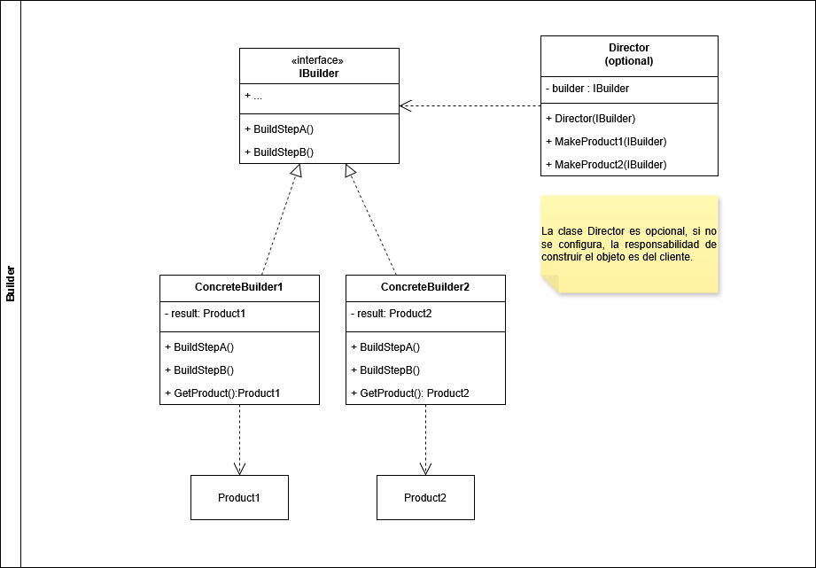
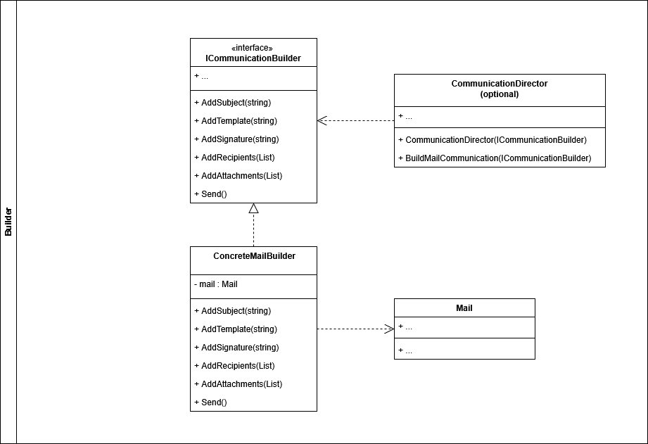

# Builder

El patrón de diseño *Builder* permite la creación de objetos complejos a través de una serie de pasos. Adicionalmente, el patrón permite producir diferentes tipos y representaciones de un objeto usando un mismo código constructor.

Este patrón de diseño suele utilizarce en los siguientes escenarios:
- Cuando se necesite crear objetos complejos que tiene muchos parametros opcionales
- Cuando la construccion de un objeto se necesita hacer de un determinado orden o ejecutar una serie de pasos.
- Cuando se tiene metodos constructores con muchos parametros
- Cuando se requiere de una interfaz común para construir diferentes objetos.

## Componentes del patron **Builder**

- **Product**: Esta clase es la que hace referencia al objeto complejo que debe ser creado paso a paso.
- **Builder**: Es una *interface* que tiene todos los metodos necesarios para construir un objeto paso a paso.
- **Concrete Builder**: Es la implementación de la *interface Builder* con el comportamiento deseado para crear el objeto de la clase *Product*
- **Director**: Es el responsable por la orquestación del proceso de creación del objeto. Es una clase opcional, cuando no se configura, se deja la responsabilidad de la creación del objeto al cliente.

## Ejemplo Aplicado

Para efectos de ejemplo, se creará un problema ficticio el cual se resolverá a través del uso de *Builder*

## Problema:

Una aplicación encargada de enviar comunicaciones digitales, necesita crear diferentes tipos de correo. Algunos tendran archivos adjuntos, algunos podrían llevar una firma y muchos otros podrían llevar un cuerpo del mensaje.

## Solucion:

Para crear el objeto *Mail* se utiliza la *interface IBuilder* para definir cada uno de los pasos necesarios para crear la comunicacion. Con la ayuda de la clase *ConcreteMailBuilder* se definen todo los pasos necesarios para crear y poblar la instancia de la clase *Mail* 

Si desea conocer o profundizar más, dirijase a las fuentes

- [Refactoring Guru](https://refactoring.guru/design-patterns/builder).
- [Geek for Geeks](https://www.geekforgeeks.org/system-design/builder-design-pattern)