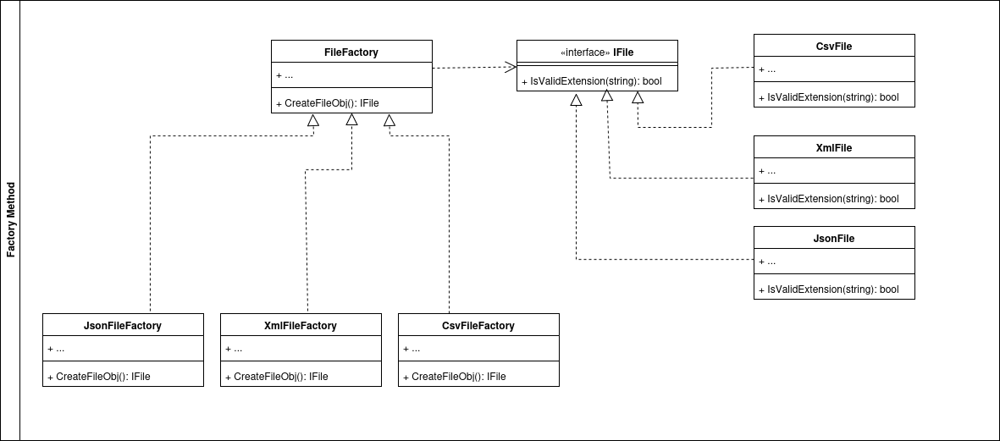
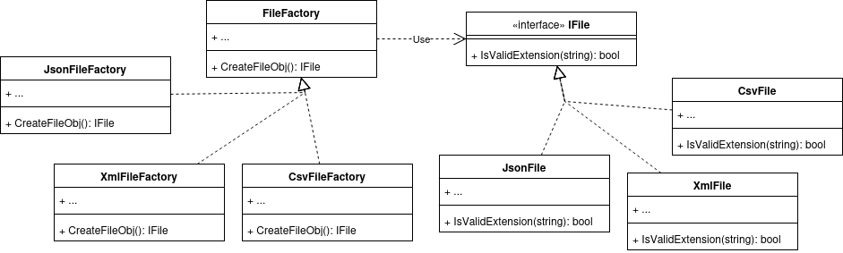

# Factory Method 

El patrón de diseño *Factory Method* forma parte de los patrones creacionales. Éste nos facilita la creación de objetos a través de una *interface* y una super clase (*Factory*) que le permite a las subclases especificar el tipo de objetos que ellas deseen crear. 

Este patrón de diseño suele utilizarce en los siguientes escenarios:
- La solución no tiene contemplado todos los posibles objetos con los que debe interactuar
- Cuando se requiera exponer una libreria o framework con el cuál un cliente pueda implementar nuevos objetos.
- Si se necesitan optimizar el consumo de recursos del sistema, reutilizando variables previamente creadas.
- Si la creacion de los objetos es compleja o depende de varios condicionales.
- Si se necesita crear diferentes versiones de un producto o introducir nuevos tipos en el futuro.

## Componentes del patron **Factory Method**

- **Creator**: Esta es una *clase abstracta* encargada de encapsular los métodos necesarios para crear los objetos.
- **Concrete Creator**: Esta clase hereda y sobreescribe los métodos definidos dentro de *Creator* para escribir la lógica propia de cada tipo de objeto.
- **Product**: Esta es una *interface* que provee los métodos comunes para todos los objetos.
- **Concrete Product**: Implementa el comportamiento real de cada uno de los productos.

## Ejemplo Aplicado
Para efectos de ejemplo, se creará un problema ficticio el cual se resolverá a través del uso de *Factory Method*

## Problema:
Una empresa X donde todos sus insumos de entrada son archivos CSV, solicita la creación de un software que les permita validar si los insumos cumplen con la extensión requerida para los archivos. 
La aplicacion, se diseño con la clase *File* validando desde su codigo en el método *IsValidExtension* la extensión *'.csv'*.
Luego de un tiempo, la empresa decide por estrategia comercial, empezar a operar archivos *json* y *xml*, sin embargo, para que la aplicacion inicial pueda operar estos tipos de archivos, es necesario modificar gran parte del código existente.

## Solucion:
El patrón *Factory Method* propone la creación de una *interface* llamada **IFile** la cual sirve de base a cualquier tipo de archivo que se desee agregar al sistema. Adicionalmente, propone la creación de una clase abstracta **FileFactory** con la que se delega toda la creación de los diferentes archivos.

Si desea conocer o profundizar más, dirijase a las fuentes

- [Refactoring Guru](https://refactoring.guru/design-patterns/factory-method).
- [Geek for Geeks](https://www.geekforgeeks.org/system-design/factory-method-for-designing-pattern)
