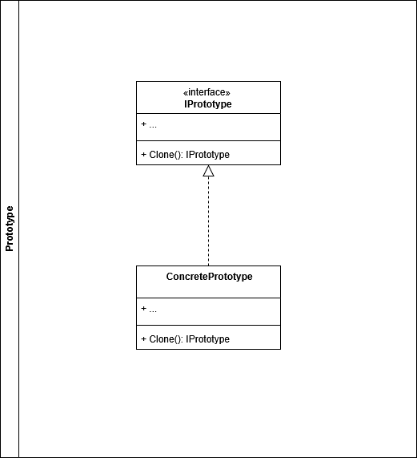

# Prototype

## Componentes del patron **Prototype**

## Ejemplo Aplicado

## Problema:

## Solucion:

Si desea conocer o profundizar más, dirijase a las fuentes

- [Refactoring Guru](https://refactoring.guru/design-patterns/prototype).
- [Geek for Geeks](https://www.geekforgeeks.org/system-design/prototype-design-pattern)