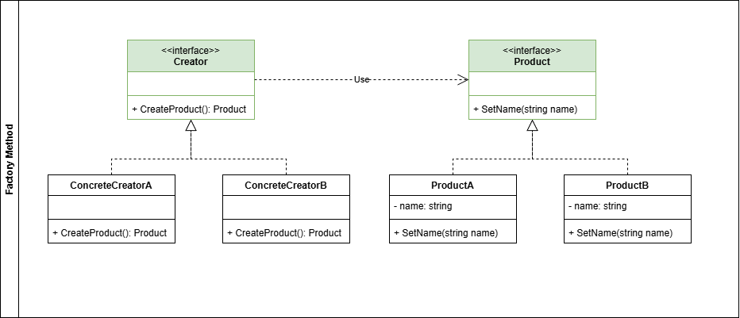
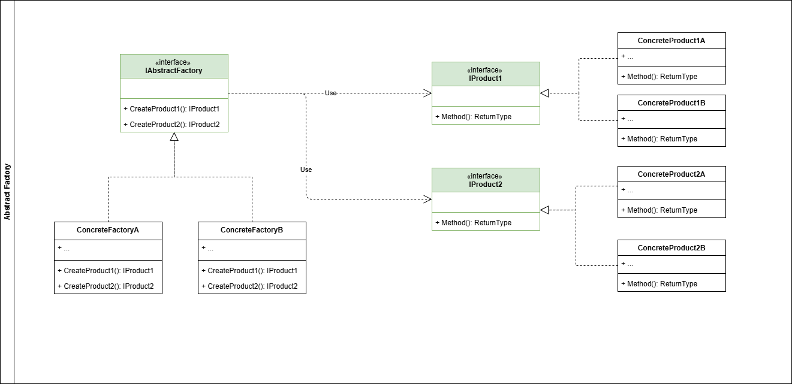
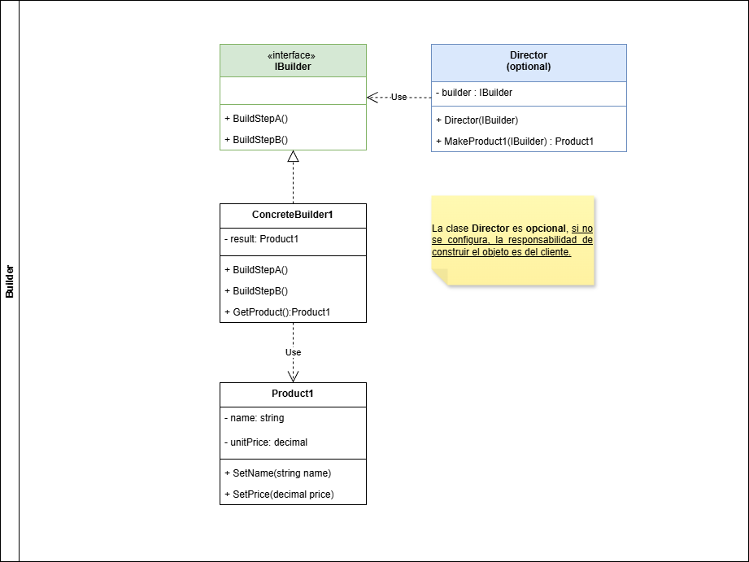
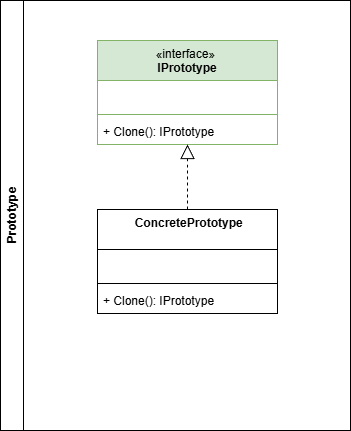
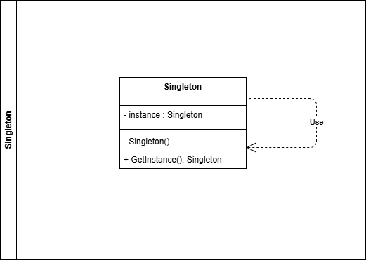

# Patrones Creacionales

## Definición

Los patrones de diseño creacionales proveen mecanismos para la creación de objetos, de manera que, el código sea fuertemente dependiente de estos. De esta manera se obtiene un código abierto a nuevas implementaciones. [según Refactoring  Guru](https://refactoring.guru/design-patterns/creational-patterns).

Estos patrones creacionales se encarga de desacoplar el sistema de la creación de los objetos, es decir, el sistema es independiente a cómo se crean los objetos, cómo se componen y cómo se representan [según Geek for Geeks](https://www.geeksforgeeks.org/system-design/software-design-patterns/#creational-design-patterns).

## Clasificación

A continuación se desarrollan para cada uno de los patrones creacionales los siguientes items:

- Definición
- ¿Cuándo usar este patrón?
- ¿Cuales son sus componentes?
- Diagrama de clases
- Ejemplo

---

## Tabla de contenido

1. [Factory Method](#factory-method)
2. [Abstract Factory](#abstract-factory)
3. [Builder](#builder)
4. [Prototype](#prototype)
5. [Singleton](#singleton)

### Factory Method

- **Definición**

El patrón de diseño *Factory Method* nos facilita la creación de objetos a través de una *interfaz* común y una super clase (*Factory*) que le permite a las subclases especificar el tipo de objetos que ellas deseen crear. Este patrón busca **desacoplar** el código de la creación de objetos.

- **¿Cuándo usar este patrón?**

Es un patrón que se debe usar cuando se necesite **dejar el código abierto a nuevas implementaciones** de objetos o cuando **no se conozca la totalidad de los objetos** con los que debe interactuar el sistema.

- **¿Cuales son sus componentes?**

  - **Creator**: Esta es una *clase abstracta* encargada de encapsular los métodos necesarios para crear los objetos.
  - **Concrete Creator**: Esta clase hereda y sobreescribe los métodos definidos dentro de *Creator* para escribir la lógica propia de cada tipo de objeto.
  - **Product**: Esta es una *interface* que provee los métodos comunes para todos los objetos.
  - **Concrete Product**: Implementa el comportamiento real de cada uno de los productos.

- **Diagrama de clases**



- **Ejemplo**

Para ejemplificar el patrón **Factory Method**, pensemos en una aplicación que debe manejar distintos tipos de archivos de entrada para sus procesos. Actualmente, solo se tienen implementados los archivos CSV y JSON, pero se tiene presente que en un futuro cercano se está pensando en integrar XML y otros archivos más.

```csharp
// Creamos una interfaz Product para los tipos de archivos
public interface IFile{
  Task<string> Read(string filePath);
  bool IsValidExtension(string extension);
}

// Creamos cada uno de los productos concretos
public class CSVFile: IFile{

  public async Task<string> Read(string filePath){
    // Simula la lectura de un archivo CSV
    await Task.Delay(100); // Simula una operación asincrónica
    return "Contenido del archivo CSV";
  }

  public bool IsValidExtension(string extension){
    // Verifica si la extensión es válida para un archivo CSV
    return extension.Equals(".csv", StringComparison.OrdinalIgnoreCase);
  }
}

public class JSONFile: IFile{

  public async Task<string> Read(string filePath){
    // Simula la lectura de un archivo JSON
    await Task.Delay(100); // Simula una operación asincrónica
    return "Contenido del archivo JSON";
  }

  public bool IsValidExtension(string extension){
    // Verifica si la extensión es válida para un archivo JSON
    return extension.Equals(".json", StringComparison.OrdinalIgnoreCase);
  }
}

// Creamos la clase abstracta Creator
public abstract class BaseFileFactory{

  public abstract IFile CreateFile();

}

// Creamos cada una de las implementaciones del Factory
public class CSVFactory : BaseFileFactory{

  public override IFile CreateFile(){
    // Retorna una nueva instancia de CSVFile
    return new CSVFile();    
  }
}

public class JSONFactory : BaseFileFactory{

  public override IFile CreateFile(){
    // Retorna una nueva instancia de JSONFile
    return new JSONFile();    
  }
}

```

De esta manera, cuando se requiera implementar un nuevo tipo de archivo, basta con crear la entidad del producto implementando la interfaz *IFile* y crear el factory respectivo heredando la clase BaseFileFactory.

[Volver a Indice](#tabla-de-contenido)

---

### Abstract Factory

- **Definición**

El patrón de diseño *Abstract Factory* permite la creación de familias de objetos usando una interfaz sin la necesidad de especificar sus clases concretas. En terminos simples [Geek for Geeks](https://www.geekforgeeks.org/system-design/abstract-factory-pattern) lo define como el camino para crear un grupo de objetos que están relacionados.

- **¿Cuándo usar este patrón?**

Este patrón se suele utilizar en los siguientes casos:
  
  1. Cuando el sistema requiera de multiples familias de objetos relacionados y se necesita asegurar su compatibilidad.
  2. Cuando se requiera dejar la puerta abierta para futuras extensiones de objetos relacionados
  3. Cuando se tienen varios *Factory Method* relacionados.

- **¿Cuales son sus componentes?**

  - **Abstract Factory**: Esta es la *interface* propuesta para la creación de las familias de objetos. Define las reglas para crear las familas de objetos.
  - **Concrete Factories**: Son las implementaciones especificas para la creación de cada una de las familias. Cada una de estas debe implementar la *interface* *Abstract Factory*
  - **Abstract Products**: Representa una familia de objetos, se definen los metodos y/o propiedades comunes.
  - **Concrete Products**: Implementación especifica de cada una de las familias de productos. Cada una de estas clases debe implementar la *interface* *Abstract Product*

- **Diagrama de clases**



- **Ejemplo**

Un ejemplo perfecto para aplicar el patrón **Abstract Factory** es el siguiente: Supongamos que se está creando una aplicacion para una tienda que vende indumentarias de moto por marca, dentro de las indumentarias se tienen prendas como Cascos, Chaquetas y Pantalones. La tienda dentro de sus marcas tiene Alpinestar, Richa y Dainese.

El patrón es perfectamente aplicable ya que cada marca representa una familia de productos. Desde el código se vería así

```csharp
// Creamos las interfaces de cada tipo de producto
// IHelmet: interfaz para las implementaciones de todos los cascos.
public interface IHelmet{
  string GetCertification();
}
// IJacket: interfaz para las implementaciones de las chaquetas.
public interface IJacket{
  string GetDescription();
  List<string> GetAvailableSizes();
}
// IPants: interfaz para las implementaciones de los pantalones.
public interface IPants{
  string GetDescription();
  string GetGuarantee();
}

// Se crean las clases concretas para cada tipo de producto
public class AlpinestarHelmet : IHelmet{

  public string GetCertification(){
    //Implementación de lógica propia para el casco Alpinestar
    return "Alpinestar Helmet certification";
  }
}
public class RichaHelmet : IHelmet{

  public string GetCertification(){
    //Implementación de lógica propia para el casco Richa
    return "Richa Helmet certification";
  }
}
public class DaineseHelmet : IHelmet{

  public string GetCertification(){
    //Implementación de lógica propia para el casco Dainese
    return "Dainese Helmet certification";
  }
}

public class AlpinestarJacket : IJacket{

  public string GetDescription(){
    //Implementación de lógica propia para la chaqueta Alpinestar
    return "Alpinestar Jacket description";
  }

  public List<string> GetAvailableSizes(){
    //Busca las tallas disponibles para la chaqueta Alpinestar
    return ["M", "L", "XL"];
  }
}
public class RichaJacket : IJacket{

  public string GetDescription(){
    //Implementación de lógica propia para la chaqueta Richa
    return "Richa Jacket description";
  }

  public List<string> GetAvailableSizes(){
    //Busca las tallas disponibles para la chaqueta Richa
    return ["L", "XL"];
  }
}
public class DaineseJacket : IJacket{

  public string GetDescription(){
    //Implementación de lógica propia para la chaqueta Dainese
    return "Dainese Jacket description";
  }

  public List<string> GetAvailableSizes(){
    //Busca las tallas disponibles para la chaqueta Dainese
    return ["M", "L"];
  }
}

public class AlpinestarPants : IPants{

  public string GetDescription(){
    //Implementación de lógica propia para el pantalón Alpinestar
    return "Alpinestar Pants description";
  }

  public string GetGuarantee(){
    return "Alpinestar Pants guarantee";
  }
}
public class RichaPants : IPants{

  public string GetDescription(){
    //Implementación de lógica propia para el pantalón Richa
    return "Richa Pants description";
  }

  public string GetGuarantee(){
    return "Richa Pants guarantee";
  }
}
public class DainesePants : IPants{

  public string GetDescription(){
    //Implementación de lógica propia para el pantalón Dainese
    return "Dainese Pants description";
  }

  public string GetGuarantee(){
    return "Dainese Pants guarantee";
  }
}


// Creamos la interfaz que ejerce la función de Abstract Factory
public interface IFactory{
  IHelmet CreateHelmet();
  IJacket CreateJacket();
  IPants CreatePants();
}

// Creamos cada uno de las Factory concretas por marca
public class AlpinestarFactory : IFactory{

  public IHelmet CreateHelmet(){
    return new AlpinestarHelmet();
  }

  public IJacket CreateJacket(){
    return new AlpinestarJacket();
  }

  public IPants CreatePants(){
    return new AlpinestarPants();
  }
}

public class RichaFactory : IFactory{

  public IHelmet CreateHelmet(){
    return new RichaHelmet();
  }

  public IJacket CreateJacket(){
    return new RichaJacket();
  }

  public IPants CreatePants(){
    return new RichaPants();
  }
}

public class DaineseFactory : IFactory{

  public IHelmet CreateHelmet(){
    return new DaineseHelmet();
  }

  public IJacket CreateJacket(){
    return new DaineseJacket();
  }

  public IPants CreatePants(){
    return new DainesePants();
  }
}
```

De esta manera si llega a entrar una nueva marca a la tienda, basta con agregar las implementaciones concretas.

[Volver a Indice](#tabla-de-contenido)

---

### Builder

- **Definición**

El patrón de diseño *Builder* permite la creación de objetos complejos a través de una serie de pasos. Adicionalmente, el patrón permite producir diferentes tipos y representaciones de un objeto usando un mismo código constructor.

- **¿Cuándo usar este patrón?**

Este patrón de diseño suele utilizarce en los siguientes escenarios:

  1. Cuando se necesite crear objetos complejos que tiene muchos parametros opcionales
  2. Cuando la construccion de un objeto se necesita hacer de un determinado orden o ejecutar una serie de pasos.
  3. Cuando se tiene metodos constructores con muchos parametros
  4. Cuando se requiere de una interfaz común para construir diferentes objetos.

- **¿Cuales son sus componentes?**

  - **Product**: Esta clase es la que hace referencia al objeto complejo que debe ser creado paso a paso.
  - **Builder**: Es una *interface* que tiene todos los metodos necesarios para construir un objeto paso a paso.
  - **Concrete Builder**: Es la implementación de la *interface Builder* con el comportamiento deseado para crear el objeto de la clase *Product*
  - **Director**: Es el responsable por la orquestación del proceso de creación del objeto. Es una clase opcional, cuando no se configura, se deja la responsabilidad de la creación del objeto al cliente.

- **Diagrama de clases**



- **Ejemplo**

Para aplicar el patrón **Builder** usaremos un ejemplo de una aplicación que utilizan para vender pizzas. Se tiene en cuenta que existe una base para la pizza que lleva pasta de tomate y queso, sin embargo en la tienda tienen diferentes combinaciones posibles como: agregar aros de cebolla, agregar tocino, agregar champiñones, agregar albaca fresca, etc.

En este ejemplo el patrón builder nos permite construir la pizza sin tener un constructor lleno de parámetros opcionales.

```csharp
// Crea el producto
public class Pizza{
  private string _description;
  private double _price;

  public Pizza(){
    _description = "Base Pizza";
    _price = 10.25;
  }

  public void AddComplement(string description, double value){
    _description += $" + {description}";
    _price += value;
  }

  public string GetDescription(){
    return _description;
  }

  public double GetPrice(){
    return _price;
  } 
}

// Crea la clase Builder
public interface IPizzaBuilder{
  IPizzaBuilder AddOnionRings();
  IPizzaBuilder AddBacon();
  IPizzaBuilder AddMushrooms();
  IPizzaBuilder AddBasil();
  Pizza GetPizza();
}

// Implementación concreta del builder
public class PizzaBuilder : IPizzaBuilder{
  private Pizza _basePizza;

  public PizzaBuilder(){
    _basePizza = new Pizza();
  }

  public IPizzaBuilder AddOnionRings(){
    _basePizza.AddComplement("Crispy Onion Rings", 1.20);
    return this;
  }

  public IPizzaBuilder AddBacon(){
    _basePizza.AddComplement("Crispy Bacon", 1.70);
    return this;
  }

  public IPizzaBuilder AddMushrooms(){
    _basePizza.AddComplement("Mushrooms", 2);
    return this;
  }

  public IPizzaBuilder AddBasil(){
    _basePizza.AddComplement("Fresh Basil", 0.75);
    return this;
  }

  public Pizza GetPizza(){
    return _basePizza;
  }
}

// Crea la clase director para que se encargue de orquestar los pasos
public class PizzaBuilderDirector{
  private IPizzaBuilder _builder;

  public PizzaBuilderDirector(IPizzaBuilder builder){
    _builder = builder;
  }

  public Pizza GetBasicPizza(){
    return _builder.GetPizza();
  }

  public Pizza GetCrispyOnionPizza(){
    return _builder.AddOnionRings()
                   .AddBacon()
                   .GetPizza();
  }

  public Pizza GetMargaritaPizza(){
    return _builder.AddBasil()
                   .GetPizza();
  }
}
```

En caso de que el restaurante necesite agregar más sabores de pizza a su menú bastaría solo con agregar los componentes y/o la orquestacion dentro del director.

[Volver a Indice](#tabla-de-contenido)

---

### Prototype

- **Definición**

El patrón de diseño *Prototype* permite la creacion de objetos a partir de un objeto previamente existente. Es decir, realizar una copia del objeto sin hacer el codigo dependiente de las clases.

Este patrón permite ocultar al cliente toda la complejidad de crear nuevas instancias de un objeto.

- **¿Cuándo usar este patrón?**

Este patrón de diseño suele utilizarce en los siguientes escenarios:
    - Cuando los tiempos o costos de creación de un objeto son altos.
    - Cuando no se desea hacer el código dependiente de las clases que se van a copiar
    - Cuando se requiere copiar un objeto muy complejo con configuraciones previas.

- **¿Cuales son sus componentes?**

  - **Prototype Interface**: Esta es la *interface* que contiene el método *clone* con el cual se realizarán las copias de los objetos.
  - **Concrete Prototype**: Esta clase es la que implementa la *interface* y sobreescribe el metodo *clone*.

- **Diagrama de clases**



- **Ejemplo**

Para aplicar el patrón **Prototype** vamos a simular un sistema donde existe una entidad Empleado, la cual tiene asignado un rol. Asumamos que crear una entidad empleado es complicado, por lo que tenemos que reutilizar el objeto existente.

```csharp
// Creo la interfaz que permite la clonación
public interface IPrototype<T>{
  T Clone();
}

// Creo la entidad Empleado
public class Employee : IPrototype<Employee>{
  private string _role;

  public Employee(string role){
    _role = role;
  }

  public Employee Clone(){
    // Retorna una copia exacta (deep copy si es necesario)
    return (Employee)this.MemberwiseClone();
  }
}
```

[Volver a Indice](#tabla-de-contenido)

---

### Singleton

- **Definición**

El patrón de diseño *Singleton* se asegura de que una clase sea instanciada una sola vez y provee un acceso global a esta instancia.

- **¿Cuándo usar este patrón?**

Este patrón de diseño se suele utilizar en los siguientes casos:
    - Se requiere centralizar el control.
    - Cuando se requiera que una instancia pueda ser accedida desde cualquier punto del código.
    - Cuando se requiere una instancia global para todos los clientes.
    - Cuando se necesite ser estricto con el control de variables gloabales.

- **¿Cuales son sus componentes?**

  - **Singleton**: Para implementar este patrón, se deben tener en cuenta las siguientes reglas: constructur privado, un campo estático para almacenar la clase, un metodo estático para retonar la instancia.

- **Diagrama de clases**



- **Ejemplo**

El patrón **Singleton** es uno de los patrones que se debe aplicar con mucho cuidado ya que este complica el desarrollo de pruebas unitarias y adicional crea acoplamiento en el código. No obstante, si se identifica que es necesario aplicarlo, el ejemplo más común es utilizar la conexión a una base de datos.

El código para aplicar este patrón es

```csharp
public class Database{
  // Se debe tener una instancia estática
  private static Database? _instance;

  private static readonly Lock _lock = new();
  
  // El constructor de la clase debe ser privado
  private Database(){
    uuid = Guid.NewGuid().ToString();
  }

  public string uuid { get; set; }

  // Debe existir un método estático que permita crear la instancia en caso de que no exista 
  // En caso de que exista, debe retornarla.
  public static Database GetInstance(){
    if(_instance is null){
        lock (_lock){
          _instance ?? = new();
          uuid = Guid.NewGuid().ToString();
        }
    }
    return _instance;
  }
}
```

[Volver a Indice](#tabla-de-contenido)
