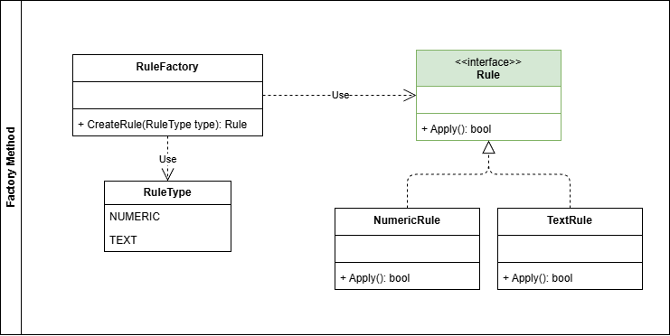

# Ejemplo de aplicación del patrón Factory Method

Para ejemplificar el patrón **Factory Method**, se ha creado un ejemplo de un validador de reglas, donde se tiene una interfaz **Rule** que define el método `Apply()`, y las implementaciones concretas de esta interfaz, como **NumericRule** y **TextRule**.

El patrón creacional **Factory Method** permite crear cualquier regla sin necesidad de conocer la clase concreta que se va a instanciar. Para esto, se define una clase **RuleFactory** que tiene un método `CreateRule(enum ruleType)` que devuelve una instancia de la regla correspondiente según el tipo especificado.

