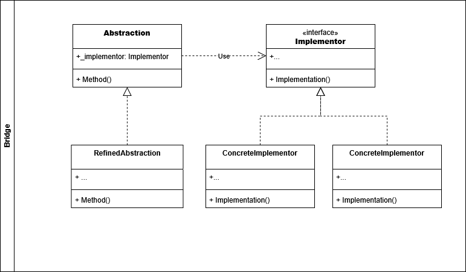
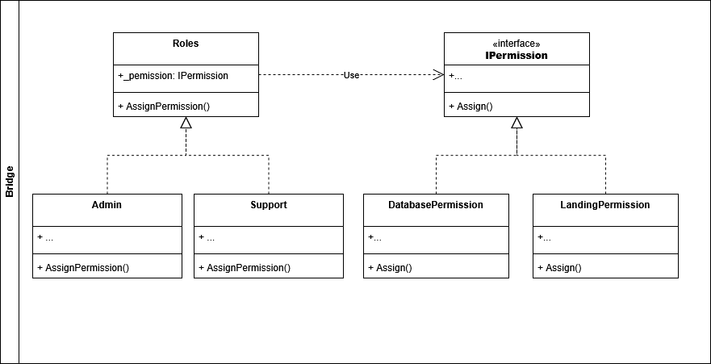

# Bridge

El patrón de diseño *Bridge* permite dividir una clase muy larga o un conjunto de clases que esten fuertemente relacionadas en dos jerarquias *Abstractions* e *Implementations*. Esto permite que ambas jerarquias puedan desarrollarse de manera independiente.

El sitio web [Refactoring Guru](https://refactoring.guru/design-patterns/bridge) resume esto con un ejemplo básico y fácil de entender. Supongamos que tenemos una clase *Figura* la cual tiene implementaciones como *Circulo* y *Cuadrado*. Se desea incorporar a esta clase *Figura* diferentes colores como lo son *Rojo* y *Azul*. Si se implementa estos colores en la jerarquia de figura se duplicarían las clases concretas:
*Circulo Rojo*, *Circulo Azul*, *Cuadrado Rojo*, *Cuadrado Azul*. A medida que la jerarquia crece, se hace más tedioso realizar nuevas implementaciones.

Para resolver este problema, se dividen dos claras jerarquias *Figuras* y *Colores*. Donde la *Figura* contiene un *Color*.

## Componentes del patron **Bridge**

- **Abstraction**: Provee el control logico a alto nivel. Esta clase contiene la referencia al *Implementer*.

- **Refined Abstraction**: Esta clase es la implementación concreta de la clase *Abstraction*.

- **Implementer**: Esta es la *interface* para las clases de la jerarquia *Implementations*. 

- **Concrete Implementartion**: Contiene la implementacion concreta de la *interface* *Implementer*.

## Ejemplo Aplicado

Para efectos de ejemplo, se creará un problema ficticio el cual se resolverá a través del uso de *Bridge*

## Problema:
Un sistema X tiene diferentes roles para controlar el acceso de los usuarios a los aplicativos. Un rol puede tener uno o más permisos asignados. El sistema inicialmente se creo con los roles: *Admin* y *Support*. Los permisos creados fueron *DatabasePermission* y *LandingPermission*. 

Si quisieramos crear combinaciones entre roles y permisos existentes, la jerarquia se haría más grande.

## Solucion:
Para tener los roles y permisos de manera independiente, se crean dos jerarquias *Roles* y *Permissions*. 

De esta manera un *Rol* puede implementar una lista de *Permisos* y en caso de que se cree un rol nuevo o un permiso nuevo no se tenga que modificar todo el codigo.

Si desea conocer o profundizar más, dirijase a las fuentes

- [Refactoring Guru](https://refactoring.guru/design-patterns/bridge).
- [Geek for Geeks](https://www.geeksforgeeks.org/system-design/bridge-design-pattern/)