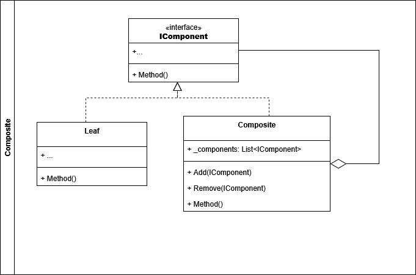
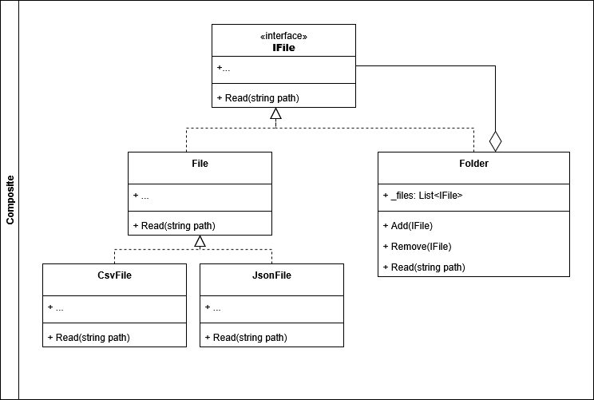

# Composite

## Componentes del patron **Composite**

## Ejemplo Aplicado

Para efectos de ejemplo, se creará un problema ficticio el cual se resolverá a través del uso de *Composite*

## Problema:

## Solucion:

Si desea conocer o profundizar más, dirijase a las fuentes

- [Refactoring Guru](https://refactoring.guru/design-patterns/composite).
- [Geek for Geeks](https://www.geeksforgeeks.org/java/composite-design-pattern-in-java/)