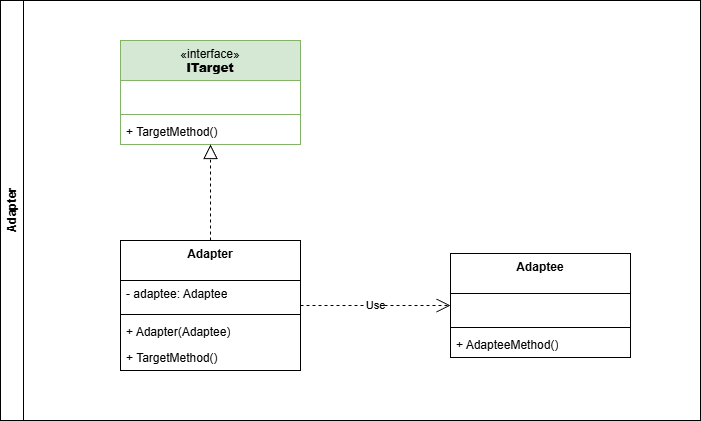
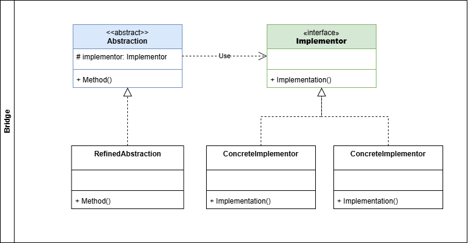
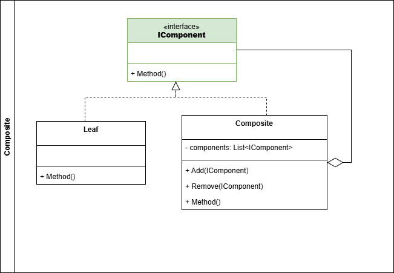
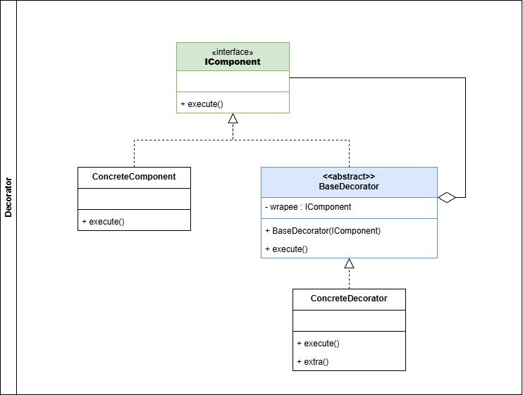
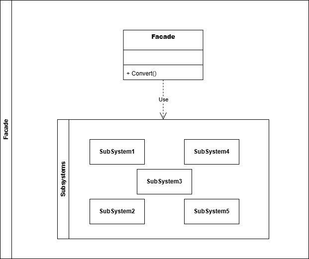
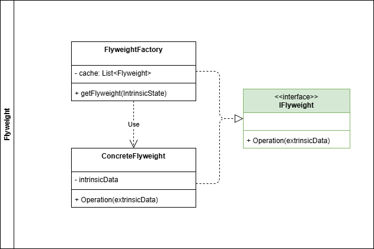
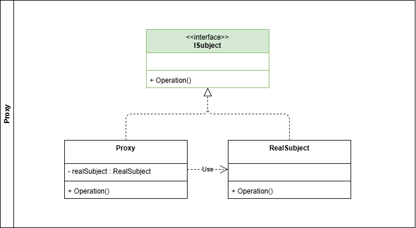

# Patrones Estructurales

## Definición

Los patrones de diseño estructurales se encargan de mostrar cómo se deben organizar y componer las clases y objetos, explican cómo se deben ensamblar, permitiendo flexibilidad en sistemas complejos. [Refactoring Guru](https://refactoring.guru/design-patterns/structural-patterns).

Para [Geek for Geeks](https://www.geeksforgeeks.org/system-design/structural-design-patterns/) los patrones de diseño estructurales se enfocan en organizar clases y objetos dentro de largas estructuras de manera eficiente y mantenible. Estos son los encargados de describir las diferentes formas que se puede componer un objeto para realizar nuevas funcionalidades. Simplifica el manejo de jerarquias complejas.

## Clasificación

A continuación se desarrollan para cada uno de los patrones creacionales los siguientes items:

- Definición
- ¿Cuándo usar este patrón?
- ¿Cuales son sus componentes?
- Diagrama de clases
- Ejemplo

---

## Tabla de contenido

1. [Adapter](#adapter)
2. [Bridge](#bridge)
3. [Composite](#composite)
4. [Decorator](#decorator)
5. [Flyweight](#flyweight)
6. [Proxy](#proxy)

### Adapter

- **Definición**

El patrón de diseño *adapter* funge como un puente para la colaboración entre objetos incompatibles, es decir, que no tienen una *interfaz* común, permitiendo que estos objetos trabajen juntos.

- **¿Cuándo usar este patrón?**

Este patrón se suele utilizar en los siguientes escenarios:

1. Cuando se requiere utilizar código existente pero las interfaces no son compatibles con el resto del código.
2. Cuando se necesite utilizar subclases que no pueden ser agregadas en una superclase.
3. Cuando necesitas implementar librerias existentes que son incompatibles con tu codigo.
4. Cuando el proyecto crece, el patrón permite agregar este nuevo codigo sin afectar el existente.

- **¿Cuales son sus componentes?**

  - **Target Interface**: Define la *interface* con la que el cliente va interactuar.
  - **Adaptee**: Clase existente que es incompatible con el código actual.
  - **Adapter**: El adaptador implementa la *interface* e internamente genera una instancia de la clase *Adaptee* para hacerla compatible con la *interface*.

- **Diagrama de clases**



- **Ejemplo**

Para ejemplificar el patrón **Adapter** simularemos un problema recurrente. Una pasarela de pagos debe integrarse con una plataforma externa para realizar los pagos de determinado banco. Dentro de nuestro sistema de pasarela de pagos, el cliente se integra con la ayuda de la interfaz IPayment, sin embargo el Banco X expone una API propia la cual no es compatible con IPayment.

```csharp
// La interfaz payment es la representación de ITarget
public interface IPayment{
  bool Pay(string reference, double value);
}

// Esta clase cumple la función de adaptador
public class PaymentXAdapter : IPayment{

  private readonly IPaymentX _paymentBankX;

  public PaymentXAdapter(IPaymentX paymentBankX)
  {
    _paymentBankX = paymentBankX;
  }

  public bool Pay(string reference, double value){
    //Implementa lógica previa de pagos
    return _paymentBankX.PayBill(DateTime.UtcNow, reference, value);
  }
}

// Interfaz usada por el banco X 
public interface IPaymentX{
  bool PayBill(DateTime transactionDate, string payReference, double value);
}
```

[Volver a Indice](#tabla-de-contenido)

---

### Bridge

- **Definición**

El patrón de diseño *Bridge* permite dividir una jerarquia de clases muy extensa y que se desarrollan por separado, en dos jerarquias *Abstractions* e *Implementations*. Esto habilita que ambas jerarquias puedan desarrollarse de manera independiente.

El sitio web [Refactoring Guru](https://refactoring.guru/design-patterns/bridge) resume esto con un ejemplo básico y fácil de entender. Supongamos que tenemos una clase *Figura* la cual tiene implementaciones como *Circulo* y *Cuadrado*. Se desea incorporar a esta clase *Figura* diferentes colores como lo son *Rojo* y *Azul*. Si se implementa estos colores en la jerarquia de figura se duplicarían las clases concretas:
*Circulo Rojo*, *Circulo Azul*, *Cuadrado Rojo*, *Cuadrado Azul*. A medida que la jerarquia crece, se hace más tedioso realizar nuevas implementaciones.

Para resolver este problema, se dividen dos claras jerarquias *Figuras* y *Colores*. Donde la *Figura* contiene un *Color*.

- **¿Cuándo usar este patrón?**

El patrón brige se debe usar en los siguientes escenarios:

  1. Cuando una jerarquía crece de manera exponencial debido a la combinación de multiples variables de dimensión.
  2. Cuando se desee separar la lógica de los detalles de la implementación de la jerarquía, de modo de que evolucionen independiente.

- **¿Cuales son sus componentes?**

  - **Abstraction**: Provee el control logico a alto nivel. Esta clase contiene la referencia al *Implementer*.
  - **Refined Abstraction**: Esta clase es la implementación concreta de la clase *Abstraction*.
  - **Implementer**: Esta es la *interface* para las clases de la jerarquia *Implementations*.
  - **Concrete Implementation**: Contiene la implementacion concreta de la *interface* *Implementer*.

- **Diagrama de clases**



- **Ejemplo**

Usaremos un ejemplo básico para representar el patrón **Bridge**, supongamos que nuestra aplicación es usada por una empresa que presta mobiliario para eventos. Dentro del catalogo de sus productos tienen mesas, sillas entre otros mobiliarios. Cada uno de ellos está en diferentes materiales como madera, plastico, metal etc.

El patrón brige nos permite separar el mobiliario (Abstractions) y los materiales (Implementations). De esta manera cada que ingrese un nuevo mobiliario no se debe modificar los materiales, y viceversa, cuando ingrese un material, el mobiliario no debe verse afectado.

```csharp
// Cumple la función de Abstraction
public interface IFurniture
{
    string GetSizeDescription();
    string GetMaterial();
}

// Cumple la función de Implementer
public interface IMaterial
{
    string GetDescription();
}

// Implementaciones de las Abstractions

public class Desk : IFurniture
{
    private readonly IMaterial _material;

    public Desk(IMaterial material)
    {
        _material = material;
    }

    public string GetSizeDescription()
    {
        return "Escritorio de tamaño estándar.";
    }

    public string GetMaterial()
    {
        return _material.GetDescription();
    }
}

public class Sofa : IFurniture
{
    private readonly IMaterial _material;

    public Sofa(IMaterial material)
    {
        _material = material;
    }

    public string GetSizeDescription()
    {
        return "Sofá de tamaño grande.";
    }

    public string GetMaterial()
    {
        return _material.GetDescription();
    }
}

// Implementaciones concretas de Implementations

public class Wood : IMaterial
{
    public string GetDescription()
    {
        return "Hecho de madera.";
    }
}

public class Metal : IMaterial
{
    public string GetDescription()
    {
        return "Hecho de metal.";
    }
}

public class Plastic : IMaterial
{
    public string GetDescription()
    {
        return "Hecho de plástico.";
    }
}

// Ejemplo de uso del patrón Bridge
public class Client
{
    public void DisplayFurnitureDetails()
    {
        // Crear materiales
        IMaterial wood = new Wood();
        IMaterial metal = new Metal();

        // Crear mobiliario con diferentes materiales
        IFurniture woodenDesk = new Desk(wood);
        IFurniture metalSofa = new Sofa(metal);

        // Mostrar detalles
        Console.WriteLine($"Mobiliario: {woodenDesk.GetSizeDescription()}, Material: {woodenDesk.GetMaterial()}");
        Console.WriteLine($"Mobiliario: {metalSofa.GetSizeDescription()}, Material: {metalSofa.GetMaterial()}");
    }
}

```

[Volver a Indice](#tabla-de-contenido)

---

### Composite

- **Definición**

El patrón de diseño *Composite* permite organizar objetos dentro de estructura de árboles. El objetivo de este patrón es poder interactuar con un objeto simple (hoja) de la misma manera que con un objeto compuesto.

**NOTA**: Este patron solo es aplicable a modelos que se puedan representar como un *árbol*.

- **¿Cuándo usar este patrón?**

El patrón composite se puede usar en los siguientes escenarios:

 1. Cuando se necesite representar estructuras jerárquicas de objetos, donde unos objetos pueden contener otros similares.
 2. Cuando se requiera dar un tratamiento uniforme a los objetos.
 3. Cuando se requieran operaciones recursivas sobre una estructura de datos.

- **¿Cuales son sus componentes?**

  - **Component**: El componente declara la *interface* para los objetos en la composicion. También permite acceder y administrar los componentes hijos.
  - **Leaf**: Define el comportamiento para los objetos primitivos dentro de la composicion. Este es la implementacion base de la composicion. Representa la implementación de la *interface* *Component*.
  - **Composite**: Almacena los componentes hijos e implementa las operaciones entre los hijos. Los hijos pueden ser *Leaf* u otros *Composite*.

- **Diagrama de clases**



- **Ejemplo**

Para representar el patrón **Composite** usaremos el siguiente ejemplo: Una aplicación utiliza un archivo json que contiene un esquema de cómo debe leer los diferentes insumos que envían sus clientes. Este esquema tiene una estructura definida por Componentes y campos del componente. Un componente puede tener dentro de si uno o más campos de componentes, adicionalmente, también es posible que contenga otros componentes.

El patrón nos permite jerarquizar esta estructura del json fácilmente.

```csharp
// Interfaz Component
public interface IComponent
{
    string GetValue();
}

// Leaf: Elemento más simple de la jerarquía
public class FieldComponent : IComponent
{
    private readonly string _value;

    public FieldComponent(string value)
    {
        _value = value;
    }

    public string GetValue()
    {
        return _value; // Devuelve el valor del campo
    }
}

// Composite: Puede contener otros componentes (hijos)
public class Component : IComponent
{
    private readonly List<IComponent> _components;

    public Component()
    {
        _components = new List<IComponent>();
    }

    public void AddComponent(IComponent component)
    {
        _components.Add(component); // Agrega un componente hijo
    }

    public string GetValue()
    {
        // Combina los valores de todos los componentes hijos
        string result = "Componente compuesto: ";
        foreach (IComponent comp in _components)
        {
            result += comp.GetValue() + " ";
        }
        return result.Trim();
    }
}

// Ejemplo de uso del patrón Composite
public class Client
{
    public void DisplayComponentValues()
    {
        // Crear componentes simples (Leaf)
        IComponent field1 = new FieldComponent("Campo 1");
        IComponent field2 = new FieldComponent("Campo 2");

        // Crear un componente compuesto (Composite)
        Component composite = new Component();
        composite.AddComponent(field1);
        composite.AddComponent(field2);

        // Crear un componente compuesto más grande
        Component root = new Component();
        root.AddComponent(composite);
        root.AddComponent(new FieldComponent("Campo 3"));

        // Mostrar los valores de los componentes
        Console.WriteLine(root.GetValue());
    }
}
```

[Volver a Indice](#tabla-de-contenido)

---

### Decorator

- **Definición**

El patrón **Decorator** permite que el comportamiento de los objetos sea agregado de manera individual y dinámica sin necesidad de modificar la clase original o afectar otros objetos. Este patrón funciona como una especie de envoltorio, donde cada funcionalidad o comportamiento nuevo es una capa que envuelve el objeto.

- **¿Cuándo usar este patrón?**

Este patrón se utiliza en los siguientes escenarios:
    1. Cuando se necesite agregar comportamientos a objetos existentes.
    2. Cuando se requiera añadir comportamientos en tiempo de ejecución.
    3. Cuando añadir comportamientos trae una explosión de subclases.

- **¿Cuales son sus componentes?**

  - **Component**: Está es la *interfaz* que define el contrato tanto de los componentes como de los decoradores.
  - **Concrete Component**: Es la implementación concreta de un componente.
  - **Decorator**: Está es una clase abstracta que implementa la interfaz del componente y la cual mantiene una referencia con el objeto decorado.
  - **Concrete Decorators**: Sobreescriben los comportamientos definidos por el decorador.

- **Diagrama de clases**



- **Ejemplo**

Para ejemplificar el patrón **Decorador** utilicemos a un personaje de un videojuego, el cual a medida que avanza en la historia puede ir incrementando sus habilidades. Cada objeto que use este personaje, tiene un efecto en sus habilidades. Por ejemplo: El escudo le da al personaje +5 puntos en proteccion, la espada le da +10 de ataque, etc.

El patron decorator me permite tener un personaje base y con la ayuda de los decoradores ir implementando más comportamientos.

```csharp
// Componente base
public interface ICharacter
{
    string GetDescription();
    int GetAttack();
    int GetDefense();
}

// Componente concreto
public class BaseCharacter : ICharacter
{
    public string GetDescription()
    {
        return "Personaje base";
    }

    public int GetAttack()
    {
        return 10; // Ataque base
    }

    public int GetDefense()
    {
        return 5; // Defensa base
    }
}

// Decorador base
public abstract class CharacterDecorator : ICharacter
{
    protected ICharacter _character;

    public CharacterDecorator(ICharacter character)
    {
        _character = character;
    }

    public virtual string GetDescription()
    {
        return _character.GetDescription();
    }

    public virtual int GetAttack()
    {
        return _character.GetAttack();
    }

    public virtual int GetDefense()
    {
        return _character.GetDefense();
    }
}

// Decorador concreto: Escudo
public class ShieldDecorator : CharacterDecorator
{
    public ShieldDecorator(ICharacter character) : base(character) { }

    public override string GetDescription()
    {
        return _character.GetDescription() + " con un escudo";
    }

    public override int GetDefense()
    {
        return _character.GetDefense() + 5; // Aumenta la defensa en 5
    }
}

// Decorador concreto: Espada
public class SwordDecorator : CharacterDecorator
{
    public SwordDecorator(ICharacter character) : base(character) { }

    public override string GetDescription()
    {
        return _character.GetDescription() + " con una espada";
    }

    public override int GetAttack()
    {
        return _character.GetAttack() + 10; // Aumenta el ataque en 10
    }
}

// Ejemplo de uso del patrón Decorator
public class Client
{
    public void Run()
    {
        // Crear un personaje base
        ICharacter character = new BaseCharacter();
        Console.WriteLine($"{character.GetDescription()} - Ataque: {character.GetAttack()}, Defensa: {character.GetDefense()}");

        // Decorar al personaje con un escudo
        character = new ShieldDecorator(character);
        Console.WriteLine($"{character.GetDescription()} - Ataque: {character.GetAttack()}, Defensa: {character.GetDefense()}");

        // Decorar al personaje con una espada
        character = new SwordDecorator(character);
        Console.WriteLine($"{character.GetDescription()} - Ataque: {character.GetAttack()}, Defensa: {character.GetDefense()}");
    }
}
```

[Volver a Indice](#tabla-de-contenido)

---

### Facade

- **Definición**

EL patrón **Facade** provee una interfaz simple y unificada hacia un subsistema complejo. El objetivo del patrón es esconder la complejidad interna haciendo que el sistema sea sencillo y fácil de mantener.

- **¿Cuándo usar este patrón?**

El patrón es utilizado en los siguientes escenarios:
    1. Cuando se requiere exponer una interfaz simple ya que el subsistema es complejo.
    2. Cuando se necesite minimizar la comunicación y dependencias entre subsistemas.

- **¿Cuales son sus componentes?**

  - **Facade**: Es la clase expuesta al cliente que se encarga de delegar las responsabilidades al subsistema.
  - **Subsystem**: Son las clases que componen el subsistema complejo.

- **Diagrama de clases**



- **Ejemplo**

Para representar el patrón **Facade** podemos utilizar el siguiente ejemplo: Existe un sistema complejo que lee archivos de diferentes tipos, aplica reglas de transformacion de datos y guarda la información en una base de datos, para simplificar el uso del sistema por parte de los clientes, se expone una fachada con un solo método para procesar archivo.

```csharp

public interface IRepository{
    bool Save(string data);
}

public class CSVRepository : IRepository{
    public bool Save(string data){
        //Implementa lógica para guardar en base de datos o archivo
        Console.WriteLine("Guardando datos en el repositorio...");
        return true;
    }
}

public interface IRuleManager{
    string ApplyRule();
}

public class CSVRuleManager : IRuleManager{

    private readonly string _data;

    public CSVRuleManager(string data){
        _data = data;
    }

    public string ApplyRule(){
        //Implementa lógica para aplicar las reglas de transformación
        Console.WriteLine("Aplicando reglas de transformación a los datos...");
        return $"Datos transformados: {_data.ToUpper()}";
    }
}

public interface IFileReader{
    string Read(string filePath);
}

public class CSVReader : IFileReader{
    public string Read(string filePath){
        //Implementa lógica de lectura de archivos
        Console.WriteLine($"Leyendo datos del archivo: {filePath}...");
        return "Datos leídos del archivo CSV...";
    }
}

// Facade: Clase simple expuesta a los clientes para procesar archivos
public class FileProcessor {

    private readonly string _filePath;

    public FileProcessor(string filePath) {
        _filePath = filePath;
    }

    // Método principal que coordina las operaciones del subsistema
    public bool Process() {
        Console.WriteLine("Iniciando el procesamiento del archivo...");

        // Leer el archivo
        IFileReader reader = new CSVReader();
        string dataRead = reader.Read(_filePath);

        // Aplica reglas de transformación de datos
        IRuleManager ruleManager = new CSVRuleManager(dataRead);
        string dataTransformed = ruleManager.ApplyRule();

        // Guardar los datos transformados en el repositorio
        IRepository repository = new CSVRepository();
        bool isSaved = repository.Save(dataTransformed);

        Console.WriteLine("Procesamiento del archivo completado.");
        return isSaved;
    }
}
```

[Volver a Indice](#tabla-de-contenido)

---

### Flyweight

- **Definición**

Este patrón de diseño es una forma de optimizar el uso de la memoria en aplicaciones que crean un gran número de objetos similares. Lo que propone el patrón es buscar el estado compartido de los objetos para reusarlo mientras sea posible.

Los datos se dividen entre los datos comunes entre objetos (Intrinsic) y los datos unicos de los objetos (Extrinsic).

- **¿Cuándo usar este patrón?**

Para utilizar este patrón se tienen los siguientes escenarios:
    1. Cuando se tiene una gran cantidad de objetos con datos similares.
    2. Cuando se tienen datos compartidos entre los objetos
    3. Cuando se identifica que el consumo de memoria es alto debido a los objetos creados.

- **¿Cuales son sus componentes?**

    -**Flyweight Factory**: Maneja el pool de objetos flyweight creados y provee los metodos para retornarlos.
    -**Flyweight**: Define la interfaz con la cual el objeto flyweight recibe y actua con los datos unicos.
    -**Concrete Flyweight**: Implementa la interfaz del flyweight y representa los objetos que pueden ser compartidos. Almacena el estado intrinseco.

- **Diagrama de clases**



- **Ejemplo**

```csharp
//Interfaz Flyweight
public interface IShape
{
    void Draw(string color); // Método que utiliza el estado extrínseco (color)
}

// Concrete Flyweight: Implementación concreta de la interfaz Flyweight
public class Circle : IShape
{
    private readonly string _intrinsicState; // Estado intrínseco compartido

    public Circle()
    {
        _intrinsicState = "Círculo"; // Estado intrínseco común a todos los círculos
    }

    public void Draw(string color)
    {
        // El color es el estado extrínseco, proporcionado en tiempo de ejecución
        Console.WriteLine($"Dibujando un {_intrinsicState} de color {color}");
    }
}

// Flyweight Factory: Administra los objetos Flyweight
public class ShapeFactory
{
    private readonly Dictionary<string, IShape> _shapes = new();

    public IShape GetShape(string shapeType)
    {
        // Verifica si el objeto ya existe en el pool
        if (!_shapes.ContainsKey(shapeType))
        {
            // Si no existe, lo crea y lo agrega al pool
            switch (shapeType)
            {
                case "Circle":
                    _shapes[shapeType] = new Circle();
                    break;
                default:
                    throw new ArgumentException("Tipo de forma no soportado");
            }
        }

        // Retorna el objeto compartido
        return _shapes[shapeType];
    }
}

// Cliente: Utiliza el patrón Flyweight
public class Client
{
    public void Run()
    {
        ShapeFactory shapeFactory = new ShapeFactory();

        // Crear múltiples círculos con diferentes colores
        IShape redCircle = shapeFactory.GetShape("Circle");
        redCircle.Draw("Rojo"); // Usa el estado extrínseco "Rojo"

        IShape blueCircle = shapeFactory.GetShape("Circle");
        blueCircle.Draw("Azul"); // Usa el estado extrínseco "Azul"

        IShape greenCircle = shapeFactory.GetShape("Circle");
        greenCircle.Draw("Verde"); // Usa el estado extrínseco "Verde"

        // Verificar que los objetos son compartidos
        Console.WriteLine("¿Los círculos son el mismo objeto? " + (redCircle == blueCircle)); // True
    }
}
```

[Volver a Indice](#tabla-de-contenido)

---

### Proxy

- **Definición**

- **¿Cuándo usar este patrón?**

- **¿Cuales son sus componentes?**

- **Diagrama de clases**



- **Ejemplo**

```csharp
//Implementacion
```

[Volver a Indice](#tabla-de-contenido)
